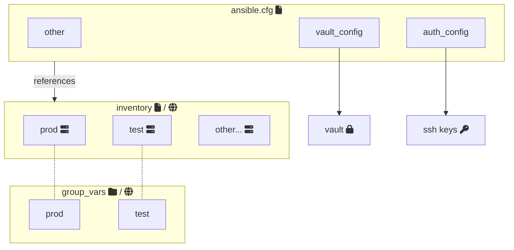
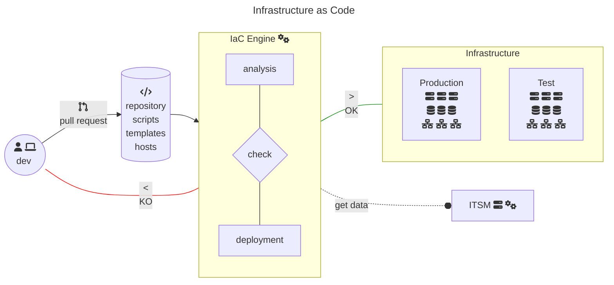

# Ansible architecture

# IaC

# Ansible

- a static or dynamic inventory of all the nodes to manage
- ssh keys to use
- users and secrets to connect to the hosts
- whether to do privilege escalation (eg. sudo, ...) before running tasks
- if nodes should be accessed via a bastion host, docker, ...
