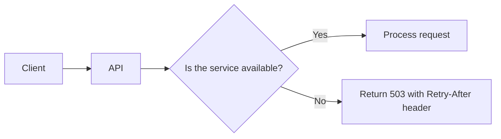

# Service Management

Our `api.get_status` implementation always returns `200 OK`,
but real world APIs return different kinds of errors.

An interoperable API should:

- fail fast, avoiding that application errors result in stuck connections;
- implement a clean error semantic.

----

A Service Management framework should
set the following expectations:

- if the Service is unavailable, we must return `503 Service Unavailable` http status
- we must return the `Retry-After` header specifying the number of seconds
  when to retry.



To implement this we must:

1. add the returned headers in the OAS3 interface;
2. pass the headers to the flask Response

----

### Exercise

Modify the OAS3 spec in [ex-04-01-headers.yaml](/edit/notebooks/oas3/ex-04-01-headers-ok.yaml) and:

- add a `503` response to the `/status` path;
- when a `503` is returned, the `retry-after` header is returned.

----

Hint: you can define a header in `components/headers` like that:

```yaml
components:
  headers:
    Retry-After:
      description: |-
        Retry contacting the endpoint *at least* after seconds.
        See https://tools.ietf.org/html/rfc7231#section-7.1.3
    schema:
      type: integer
      format: int32
      example: 30
```

----

Or just `$ref` the `Retry-After` defined in <components.oas3.yaml#/components/headers/Retry-After>

Modify [api.py:get_status](/edit/notebooks/oas3/api.py) such that:

- returns a `503` on 20% of the requests;
- when a `503` is returned, the `retry-after` header is returned;
- on each response, return the `Cache-Control: no-store` header to avoid
  caching on service status.

----

Bonus track: [Google post on HTTP caching](https://developers.google.com/web/fundamentals/performance/optimizing-content-efficiency/http-caching)

```python
from random import randint
from connexion import problem

def get_status():
    headers = {"Cache-Control": "no-store"}

    p = randint(1, 5)
    if p == 5:
        return problem(
            status=503,
            title="Service Temporarily Unavailable",
            detail="Retry after the number of seconds specified in the the Retry-After header.",
            headers=dict(**headers, **{'Retry-After': str(p)})
        )
    return problem(
        status=200,
        title="OK",
        detail="So far so good.",
        headers=headers
    )
```

--

## Reusing default responses

As `503` is a quite recurring response, it's worth to define it in a reusable yaml file,
so that every path can reuse it.

----

### Exercise: reusable responses

In the following exercise you should edit [ex-04-01-headers.yaml](/edit/notebooks/oas3/ex-04-01-headers-ok.yaml) and:

- move the `503` response from the `/status` path definition to the `components/responses` one, eg.

```yaml
components:
  responses:
    503ServiceUnavailable:
      ...
```

- reference `#/components/responses/503ServiceUnavailable` in the `/status` path

----

Your new file is semantically equivalent to the previous one: check that you can
`connexion run` your file in [terminal](/terminals/connexion)!

```text
connexion run /code/notebooks/oas3/ex-04-01-headers.yaml
```
