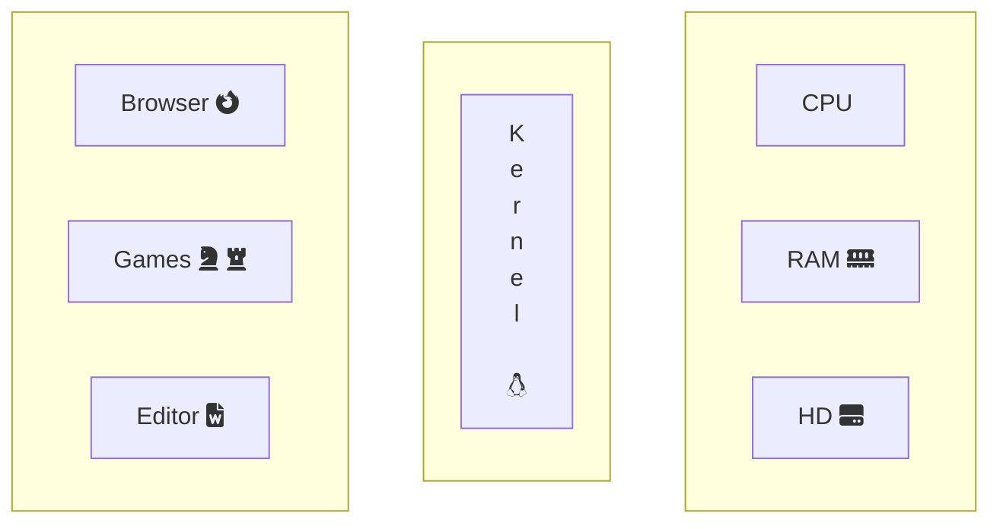

# Docker 101

This is an introductory course to containerization
and [Docker](https://docker.com).

The course will cover:

1. computational resources and the Operating System's Kernel
1. Virtualization: pros and cons
1. Processes & isolation tools
1. Containers & Docker
1. Containerization as an application packaging system
1. Practice session

---

## Computational resources

Computational resources are basically:

- RAM
- Storage
- Network
- CPU

---

## Meet the Kernel

The (Linux) kernel decides *who* and *when*
can access to RAM, CPU and disks using abstractions.

| Physical | Abstraction |
| --- | --- |
| RAM | Virtual Memory |
| CPU | Computational Shares |
| Storage & Network | File descriptors |



---

## A process is a cage

The Kernel cages programs.

It only shows them a part of the global resources.

Programs think they have a complete operating system
at their disposal.

A software requests access to resources invoking system calls.

[Image from deviantart](https://www.deviantart.com/mirinata/art/Lucky-Luke-and-the-Daltons-524439744)

---

## The cage is named "process"

The `ps` command lists the "cages" showing the assigned virtual resources.

```bash
#       process id, executable, %cpu, virtual memory size
! ps -o pid,cmd,pcpu,vsize
```

These resources are retrieved from the `/proc/$PID/stat` and other files.

```bash
! ls /proc/[0-9]*/stat
```

---

## To access hardware, you need syscall

An imaginary dialogue between your browser and your Kernel.

```mermaid
graph TB

subgraph hw
direction LR
cpu[CPU fa:fa-cpu]
ram[RAM fa:fa-memory]
storage[HD fa:fa-hdd]

end
subgraph Linux
l1
l2
l3[...]
end

subgraph Firefox
f1
f2
f3
end

f1("Hey Kernel, I want to save a file on disk!")
l1("Can you tell the magic words?")
f2("open(..);\nwrite(..);\nclose(..);")
l2("Correct!\nThree syscalls!\nI'll notify you when I'm done.")
f3("OK, I'm waiting for you!")
