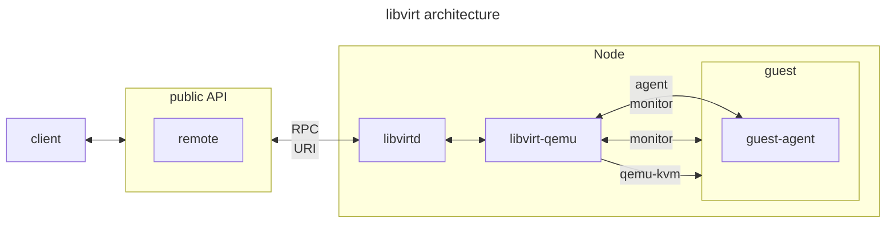

# Docker 101

This is an introductory course to containerization
and [Docker](https://docker.com).

The course will cover:

1. computational resources and the Operating System's Kernel
1. Virtualization: pros and cons
1. Processes & isolation tools
1. Containers & Docker
1. Containerization as an application packaging system
1. Practice session

---

## Computational resources

Computational resources are basically:

- RAM
- Storage
- Network
- CPU

---

## Meet the Kernel

The (Linux) kernel decides *who* and *when*
can access to RAM, CPU and disks using abstractions.

| Physical | Abstraction |
| --- | --- |
| RAM | Virtual Memory |
| CPU | Computational Shares |
| Storage & Network | File descriptors |

[](https://mermaid.live/edit#pako:eNptUl1r4zAQ_CtioW9OiO04Tvx2bY8r9HocPfpS-R4Uax2LWJKRZZJcSH77rT9CKRSx0mpmVsxKOkNhJUIGOyeaiv18zU0_2m47AqJpWs7-5kYqh4VX1gyarbOHFh2_H1dWim1WillJotIeZxNNZTuhkf-gqSVNLykqbNvZ3qhd5T9Bzto9FRysk_y7VN66iS5VjbMeJhaN_GRvzwZze3QGa_6ck4LCUZgprykYxeSwVqY7fnFQdfiiy6Lp-MPvt8mHVoWzRaUa0jmh-eu3lxuD2roTwS25FjvkT48TU8ne9d0dM-j5L7x1jL7qHfsPI_09s-v1ysZWhrQ65AYC0Oi0UJLe6EytsByoWGMOGaUSS9HVPofcXEjaNVJ4HG8PMu86DEB03v45meK2HzWPSlDjGshN3RLaCPNurb6JaAvZGY6QRat0HtG0CJNkvYpX4TKAE2Rhsp4v43AdLtJNGi2SMLoE8G84YTFfJXEaJmm0ScN4GW82AeBg6WX8asOPu_wH3KjcpA)

---

## A process is a cage

The Kernel cages programs.

It only shows them a part of the global resources.

Programs think they have a complete operating system
at their disposal.

A software requests access to resources invoking system calls.

[Image from deviantart](https://www.deviantart.com/mirinata/art/Lucky-Luke-and-the-Daltons-524439744)

---

## The cage is named "process"

The `ps` command lists the "cages" showing the assigned virtual resources.

```bash
#       process id, executable, %cpu, virtual memory size
! ps -o pid,cmd,pcpu,vsize
```

These resources are retrieved from the `/proc/$PID/stat` and other files.

```bash
! ls /proc/[0-9]*/stat
```

---

## To access hardware, you need syscall

An imaginary dialogue between your browser and your Kernel.


<!--

[](https://mermaid.live/edit#pako:eNplUlFvmzAQ_iuuX9pKBAUIIWHSpindlKitNrXdy-I8ePgcrIGNjBllUfLbd0AyVduDjb_z9913nO9AMyOApnRveZWThyemma6bHyPM2-2aW9FyCzumhbKQOWX0QMuqZrv6-o1Inko-KVVmTZarCnmWl9unj4-XGyiN7TBcO2P5Hrbru_NNLsSutwMt3ng-KN28_mtWBLhCXNHW9_3dWfNG9Rnp0vynk6iTqJPRX4kMbhhdQ0fuwWooPLIhLdeOOENq_gsIJ1IVQDCBUPXPK0Zve3vUrLgmnWmIg6IgLgdS8r3KSGusqD8MNBkizVSgb3z_9h1jurXKwQVkhanPYMjZk1fG9uVe4fVLbgFI3dUZL4q6j2yu0Ugbp2Q3GLc5aLK5LokwGvzRMcIkX-69Idxy5ZTeE2lszx9LZ_rcGnI6ncbmDqe8ZXpEk8l7RGTi4_fcfOrREmzJlcDJODBNCKP4xyUwmuJRgORN4Rhl-ojUphLcwSeh8IFp6mwDHuWNM8-dzi545Nwpjs9VUnz9osZoxfV3Y8oLCSFND_SVpuE88UPcpkEcL-bRPJh5tKNpEC_8WRQsgmmyTMJpHIRHj_4eMkz9eRwlQZyEyySIZtFy6VEYSnocB3yY8-MfIt_7sQ)

-->
---

## Kernel isolates applications and resources

[](https://mermaid.live/edit#pako:eNptkvGrmzAQx_8VOXiwgZaqtbYyBtve2GB7j_HGflncD6k5a1ATiZG2a_u_74z2jQcPvXi5-yR-75IzFFogZLA3vKu870-5Gp9-2E0B3nU98_7kSkiDhZVaOWZn9KFHwz5OX6_ku6zkQUlQqY_BnKZle94i-0JDT8yIFBX2fVArua_si5DRuqYFB20E-yyk1WZOl7LBYAxTFpV4Ia_2nLgajcKGfcuJIDNkavYbMo-M3llkI9VwfGWv6vBKoUU3sE8_fs1SWlkYXVSyI87wlj19eLhlsNXmROGehPM9sq_3c6YSo_C7O0-hZY94KxptNYq2_4XUXhC8JxXOWwSXdxc3mXs5Ji856A7Vm7dUzMFIi-TBxaunNs_EztQOaHrE-hkY-zcDUhe2cUhPf7b6mQEfWjQtl4Luw5na5uVAKlvMISNXYMmHxuaQqyuhQye4xemkILNmQB_4YPXPkypu84m5l5w63AKVTaJ86Lj6rXV7g2gK2RmOkEXrdBHRsAyTZLOO1-HKhxNkYbJZrOJwEy7TbRotkzC6-vDX7bBcrJM4DZM02qZhvIq3Wx_QSXqYrrW73dd_YMj_AQ)


## Multitasking, Virtualization & Co

Isolation enables multi-tasking and multiple users:
more people using the same computer at the same time.

Virtualization goes a step further:

- vCPU, vStorage
- virtualized kernels (Linux, Windows, ..)
- processes are executed by virtualized kernels

[](https://mermaid.live/edit#pako:eNptUlFr2zAQ_itC0Kc5wbGbONFbWQaBtWV028usPSjWpRa2JCPJTrKQ_Pae7bSjtOAPn-777tOdpBMtrATK6LMTTUnun7jhpqiF92vYkeCEJz44WwEz1kBP-nY7aqt8c2zAdcpb95ebTjPG-gJu6m5Sd3nFMYnQCPy-jL8aoRDbK9vHDhHQogJnoM43uLQI36cR3xFwlZlr3NuQ0XEntmwnJrUy7QFNwMh3bZb7nGBaKgdFUNYMMxZNm3_98Xuo7ou1KpwtStWg0gmdP909_OdAW3dEwgfrxDPkm_UbV0qJhIGQP0IgYw5C2c8RPuml05_0YsKkyh_R8te7efbKSLv3KK-Rv78eVS9oEYePg9_ckN6KXC4XgiVvu3eaDLmRKffc0IhqcFooiRd_woMknGLTGjhlGErYibYOnHJzRmnbSBHgm1Q4PsUbbiGiog3259EUr-tRs1YC59QUu6o9Zhth_lirX0W4pOxED5Rl2TRN4yTJ4mwxSzCI6JGyJI2nWZols1WymMW3yWp5jui_wSCeLpZpMp-ns9tlslgt5mlEYejoYXy-wys-vwD1sf5s)

---

Every virtualized kernel manages virtual resources
believing they are physical.

Every virtual machine "lives" in a process!

[](https://mermaid.live/edit#pako:eNqNVE2PmzAQ_SvIh15KogQ2IaGnqqkUqburatteintw8LBYGBvZhiSNNr99B-ejTZWoCzxr8Mx4Zp7H3pFccyApeTasKYP7J6qoyiWzdgFF4AyzgXVGV5AqraBX2nZ1sK2y5bYB0wmrzS-qujpN096BKtkNZEdVBUaBzJaUKo2wCIf4ggCEQaijLBEBAr-CrdKCDaRQ7QaXBcUvovq1swA1yg2qgckoQVd8Cta71VBrsw3eqZVtPvw9nvQiNzovRfMmp1sjZkQwAzmQtxL4J9obov_Xw4c8FB3s93tkAt-D1OcR9Lzjm1VdHbwPpFh1wrgrDJZrTx8XBnIntPKbnjdt9unrD8__RVy0NKzOnj4-_NH5hFFhnTbsGbLl4qwrOe-zBJc9gjvWAK7sO-FaLl19JZe-xuwRl_x-0RFrobheW897ld2jQhw7qEVsbrYO0uFZqvxYri863AA_NTiKYSGkPHb62UTpVXCeDy9Og7c5bgSaUUVCUoOpmeB4pHb9LlOC1ddASYoih4K10vUd84KmbcOZg89cII8Ez04LIWGt09-2KidYibRwMloIhozV59mGqZ9a1ycv_CXpjmxImiTDOB5FUTJKpuMIhZBsSRrFo2ESJ9F4Hk3Ho7toPnsJyW-_wGg4ncXRZBKP72bRdD6doAf4lB4ON4O_IF5eAbnjeP4)

---

You can check if your CPU supports virtualization

```bash
egrep 'vmx|svm' /proc/cpuinfo
```

Virtualization is not cheap.
There is a lot of communication going on,
and some instructions need to be serialized
and conveyed over the network.



---

## Containerization

Containerization is a way to isolate processes
without different kernels.

It is enabled by the isolation features that the Linux kernel provided
over time.

- chroot: changes the root directory confing applications to see a different filesystem hierarchy (1979)
- capabilities: restrict user privileges (1999)
- SELinux: defines access control policies for kernel resources (2000)
- namespaces: partition kernel resources, including networks and host names (2002)
- cgroups: limit and isolate resource usage (2008)

---

## Docker simplifies containers

Executes linux processes in an isolated environment
that **looks like** a virtual machine.

Every container can have one or more IP addresses.

Container's processes communicate directly with the host kernel.
