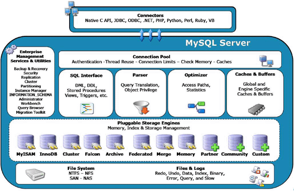

# Intro

## Goal

  - What is a database
  - ACID and non-ACID database
  - The CAP Theorem*
  - MySQL HLA
    - Connections
    - Processing
    - Storing
  - Memory & Disk usage

# What is a database

## What is a database

  - Adding data: a single-connection in-memory database. Key-Value stores. Memory fragmentation.

  - Durability: making data persistent. Checkpoints. Memory vs Storage speed. I/O bound.

  - Buffering: serving requests during checkpoints. Paging mechanism.

  - Performance impacts of durability.

## What is a database

  - Isolation: serving multiple connections. Synchronization. CPU bound.

  - Reading data: finding data. Indexes. Indexes are not a free ride.

  - Caching: Memory vs Storage speed. Index memory. Memory is not $\infty$. Fragmentation.

  - SQL: adding a language layer. Overhead of SQL. Optimization.

## What is a database

  - Consistency. Repeatable reads.

  - Atomicity: all or nothing.

  - Transactions. Managing multiple queries. Rolling back. Transaction logs.

## What is a database

Concurrency issues:

  - dirty read: a non rolled-back entry is used by another transaction
  - unrepeatable read: reading twice a single entry in a transaction gives different results (entry committed by another transaction)
  - phantom read: a special case of unrepeatable read, with multiple entries. Old entries are preserved, newly committed entries are shown.

See wikipedia [Isolation_(database_systems)](https://en.wikipedia.org/wiki/Isolation_(database_systems))

# MySQL Overview

## A bit of history

  - MySQL simplified the RDBMS

  - A plug-and-play database for the web (LAMP)

    * born on Linux
    * working on Windows, Apple and Solaris [see supported platforms for 5.7](https://www.mysql.com/support/supportedplatforms/database.html)

  - MySQL before innodb

    * speed and usability over consistency and persistency

*Some things are inherently complex*

## High Level Architecture

## MySQL HLA

  - Connection (TCP, Unix, Threads, Authentication)

  - SQL Parser / Optimizer (Caches, Authorization)

  - Query exec / cache / logging

  - Storage Engines (Disk, Memory, Network)

## Memory usage

  - Connections (per-thread buffers)

        min(max_tmp_table_size,max_heap_table_size)
        {read_rnd,join,sort}_buffer_size    # random read|sorting
        thread_stack
        binlog_{stmt_}_cache_size           # binlog

  - Internal Buffer/Caches (query cache & lock contention, database cache, ..)

        innodb_buffer_pool_size, key_buffer_size
        query_cache_size
        table_open_cache

  - OS Buffer/Caches

        $ free -h

## Disk usage

Mitigated by cache.

Increased for Consistency and Isolation:

  - each table is opened independently by each concurrent session `table_open_cache`

## Storage Engines

  - Enable persistency
  - Transactional: InnoDB, NDB
  - Non Transactional: MyISAM, Memory,
