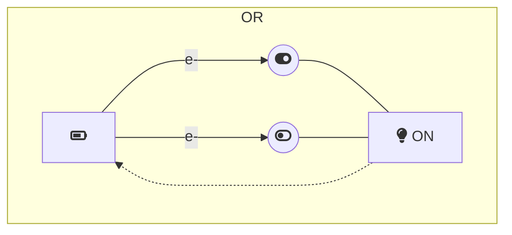

# More on numbers

## More on binary numbers

We can use f-strings to print the binary representation of a number.

```python
a = 3
print(f"{a:#b} is the binary representation of {a}")
```

Exercise: print the following numbers in binary:
  3, 61, 35.

<!-- Solution -->
<!-- print(f"{3:#b}") -->
<!-- print(f"{61:#b}")-->
<!-- print(f"{35:#b}")-->

```python
# Write your code here.
```

To align the number representations, we can specify the length of the representation (e.g., 10 characters).

```python
a = 3
print(f"{a:#10b} is the binary representation of {a}")
a = 61
print(f"{a:#10b} is the binary representation of {a}")
```

I can also specify to fill the empty spaces with `0`s.

```python
a=3
print(f"{a:#010b} is the binary representation of {a}")
a=61
print(f"{a:#010b} is the binary representation of {a}")
```

In this way I can easily compare the binary representations of two numbers.

| number |  $2^7$ | $2^6$ | $2^5$ | $2^4$ | $2^3$ | $2^2$ | $2^1$ | $2^0$ |
|--------|-------|-------|-------|-------|-------|-------|-------|-------|
| 3      | 0     | 0     | 0     | 0     | 0     | 0     | 1     | 1     |
| 61     | 0     | 0     | 1     | 1     | 1     | 1     | 0     | 1     |

----

### Bitwise operators: `<<` and `>>`

Bitwise operators are the most simple operators,
since they operate on single digits.
They are used to manipulate the binary representation of numbers.

- Exercise on the `<<` (left-shift) operator: given the following number

```python
a = 1
```

try to guess the result of the following operations. Hint: execute the cell below multiple times.

```python
a = a << 1
print(f"{a:#010b}")
```

Is there a similar operator with numbers in base 10?

- Exercise on the `>>` (right-shift) operator: given the following number

```python
a = 79
```

try to guess the result of the following operations. Hint: execute the cell below multiple times.

```python
a = a >> 1
print(f"{a:#010b}")
```

Is there a similar operator with numbers in base 10?

Discuss the results with your classmates.

### Bitwise operators: AND `&`

The `&` operator is the bitwise AND operator.
It returns 1 if both bits are 1, 0 otherwise.

```python
a = 19
b = 61
c = a & b
print(f"{a:#010b}")
print(f"{b:#010b}")
print(f"{c:#010b}")
```

| number |  $2^7$ | $2^6$ | $2^5$ | $2^4$ | $2^3$ | $2^2$ | $2^1$ | $2^0$ |
|--------|-------|-------|-------|-------|-------|-------|-------|-------|
| 19      | 0     | 0     | 0     | 0     | 0     | 0     | 1     | 1     |
| 61     | 0     | 0     | 1     | 1     | 1     | 1     | 0     | 1     |
| 19 & 61 | 0     | 0     | 0     | 1     | 0     | 0     | 0     | 1     |

The AND operator has a physical meaning: it is used to check if, in a circuit, two switches are both ON.

- 🔋--1--1--💡ON
- 🔋--0--1--💡OFF
- 🔋--1--0--💡OFF
- 🔋--0--0--💡OFF

```mermaid
subgraph AND
direction LR
    b-1[fa:fa-battery-three-quarters]
    led-1[far:fa-lightbulb OFF]
    s1-1((fa:fa-toggle-off))
    s2-1((fa:fa-toggle-on))
    b-1 --->|e-| s1-1
    s1-1 --- s2-1 --- led-1
    --- b-1
end
```

- Exercise: compute the bitwise AND of 192 and 71 by hand and check the result in the cell below.

<!-- solution: a, b = 192, 71; c = a & b; print(f"{a:#010b}"); print(f"{b:#010b}"); print(f"{c:#010b}"); -->

```python
# Write your code here.

```

### Bitwise operators: OR `|`

The `|` operator is the bitwise OR operator.
It returns 1 if at least one bit is 1, 0 otherwise.

```python
a = 6
b = 5
c = a | b
print(f"{a:#010b}")
print(f"{b:#010b}")
print(f"{c:#010b}")
```

| number |  $2^7$ | $2^6$ | $2^5$ | $2^4$ | $2^3$ | $2^2$ | $2^1$ | $2^0$ |
|--------|-------|-------|-------|-------|-------|-------|-------|-------|
| 6      | 0     | 0     | 0     | 0     | 0     | 1     | 1     | 0     |
| 5      | 0     | 0     | 0     | 0     | 0     | 1     | 0     | 1     |
| 6 \| 5 | 0     | 0     | 0     | 0     | 0     | 1     | 1     | 1     |

- Exercise: compute the bitwise OR of 192 and 71 by hand and check the result  in the cell below.

<!-- solution: a, b = 192, 71; c = a | b; print(f"{a:#010b}"); print(f"{b:#010b}"); print(f"{c:#010b}"); -->

The OR operator has a physical meaning: it is used to check if, in a circuit, at least one switch is ON.



---


## Max and min

```python
# Let's define two positive integers.
b = 234
c = 64
# Reorder the numbers so that b is smaller than c.
b, c = min(b, c), max(b, c)
print("b =", b, "c =", c)
```

Now execute the cell below many times, and see what happens.

```python
# Iterate until b is zero.
d = c - b
b, c = min(d, b), max(d, b)
print("b =", b, "c =", c)
```


---


## Importing functionalities

----

```python
# Importing new features
# ..is easy. Features are collected
# in packages or modules. Just
import math  # to use the
math.sqrt  # function

math.sqrt(2)
```

```python
# We can even import single functions
#  or constants from a module
from math import pi as π
π / 2
```

----

Modules contain documentation in the form of docstrings,
that jupyter presents in scrollable boxes.

```python

# Read the module documentation...
help(math)
```

```python
# ...or the function documentation
help(math.sqrt)

```
