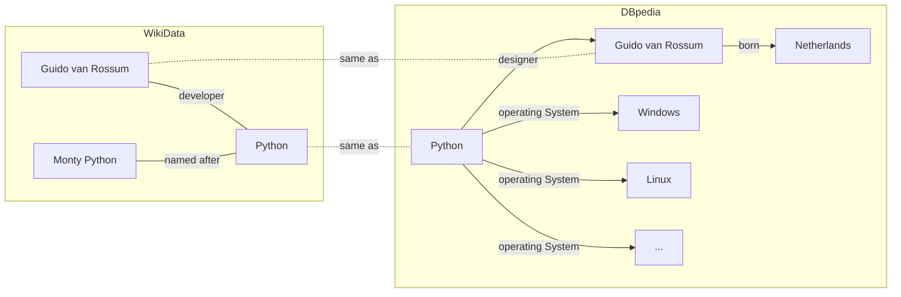
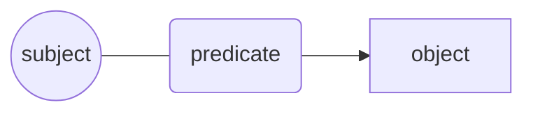
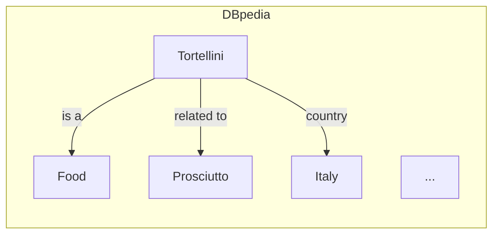
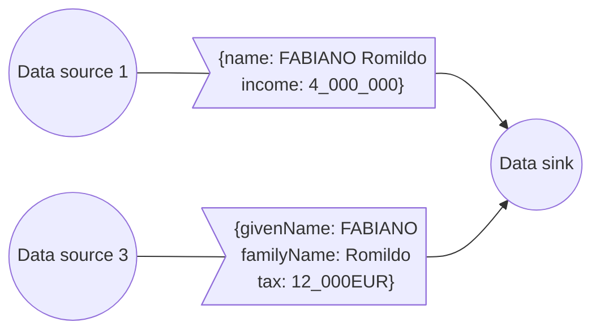
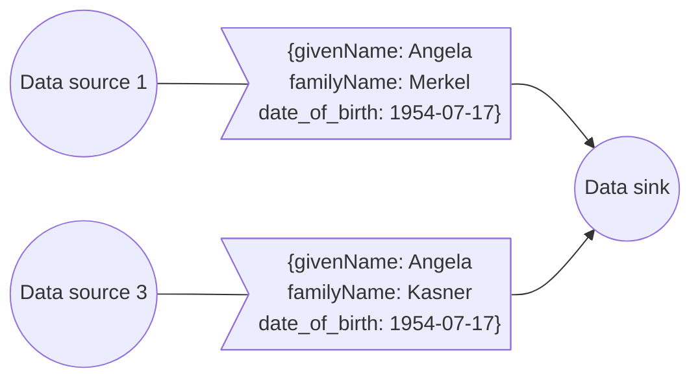

# Knowledge Management 101

## Agenda

- Knowledge management
- Semantics what?
- Triples & co
- Attaching semantics
- Graph databases
- JsonLD

*Beware*: commands may contain small typos. You have to fix them to properly complete the course!

----

Prerequisites:

- json, yaml, xmlschema
- HTTP, OpenAPI 3
- SQL and database hints

---

## Intro: What is knowledge?

Knowledge is a set of information that is useful for a given purpose.

We express knowledge through language and symbols
in various forms: text, images, and sounds.

To use knowledge we need to:

- sense;
- interpret;
- understand.

When reading a book, for example, we not only need to read and understand the words,
but also to interpret the meaning of the sentences and paragraphs
based on the context and our previous knowledge.

----

## Intro: The Encyclopedia

The Encyclopedia was one of the first attempts to organize knowledge,
and to make it available to the public.

Today, we have various encyclopedias on the web,
such as Wikipedia and dbpedia.

Exercise: open the "Python" page on dbpedia:

- https://dbpedia.org/page/Python_(programming_language)

And on Wikidata:

- https://www.wikidata.org/wiki/Q28865

----

## Intro: The Encyclopedia

Knowledge is organized in a graph structure,
where each node is a concept and the edges are the relationships between them.



This is the basis of the Semantic Web,
where knowledge is represented in a machine-readable format,
but it is also the basis of the Web itself
(e.g., see [Web Linking RFC 8288](https://datatracker.ietf.org/doc/html/rfc8288)).

----

## Intro: The Encyclopedia

The above graph can be expressed by sentences such as:

- Python is named after Monty Python.
- Guido van Rossum is the designer of Python.
- Python runs on Linux.

their general form is



## Intro: The Encyclopedia

Encyclopedia voices on Wikipedia and dbpedia are expressed in
[Resource Description Framework (RDF)](https://www.w3.org/TR/rdf11-primer/).

It is a formal language to represent knowledge in a machine-readable format
using triples of the form `subject predicate object`.

Let's translate the above definition from English to RDF:

> Tortellini are a typical Italian food,
> <br>made with pasta filled with meat such as prosciutto.

becomes something like

```turtle
:Tortellini a :Food .
:Tortellini :country dbr:Italy .
:Tortellini :relatedTo dbr:Prosciutto .
```

## Exercise: Get a voice from dbpedia

Now, let's get the actual voice from dbpedia
using the python RDF library.

```python
# Get a voice from dbpedia using rdflib
from rdflib import Graph

# What's Tortellini?
g = Graph()
g.parse("https://dbpedia.org/data/Tortellini.ttl", format="turtle")
```

We get a graph with the information about Tortellini.



An encyclopedia voice contains a list of sentences :)

```python
# List all the details about Tortellini.
sentences = list(g)

print('\n'.join([str(s) for s in sentences]))
```

Exercise:

- how many sentences are there?
- how many elements does each sentence have?


----

```python
from rdflib.namespace import RDF, RDFS, FOAF

# Now we get specific properties from the graph.
_type = list(g.objects(predicate=RDF.type))
print(_type)
```


```python
import rdflib
from rdflib.extras.external_graph_libs import rdflib_to_networkx_multidigraph
import networkx as nx
import matplotlib.pyplot as plt

G = rdflib_to_networkx_multidigraph(g)

# Plot Networkx instance of RDF Graph
pos = nx.spring_layout(G, scale=2)
edge_labels = nx.get_edge_attributes(G, 'r')
nx.draw_networkx_edge_labels(G, pos, edge_labels=edge_labels)
nx.draw(G, with_labels=True)

#if not in interactive mode for
plt.show()

```

## Intro: Semantics what?

Semantics: the study of meaning.

Semantics ensures that a message is understood;
messages include data and HTTP exchanges.

Here are some ambiguous messages:

```yaml
name: FABIANO Romildo
income: 4_000_000
```

Is this a given name or a full name?
What is the currency of the income?
Is it a monthly or yearly income?

----

Integrating data from different sources is difficult because of the lack of semantic interoperability.




----

Identifiers may differ between systems,
and even registry data are not always interoperable.



----

The lack of standardization in the format and meaning of data
hinders interoperability between the databases of different organizations,
and even inside different branches of the same organization,
and therefore the creation of digital services.

A first example is the lack of syntactic interoperability:
a well-defined entity (eg. the tax code) is represented with different fields or formats:

```
{"tax_code": "MRORSS77T05E472W"}
{"cf": "mrorss77T05E472W"}
{"taxCode": "MRORSS77T05E472W"}
```

----

Another example is semantic interoperability: the concept of family has different meanings (eg. in the fiscal domain, in the registry domain, ..):

```yaml
relatives:
  - name: Mario Rossi
    relationship: father
  - name: Carla Rossi
    relationship: sister
    cohabiting: false
```

```yaml
relatives:
  - name: Mario Rossi
    relationship: padre
```

---

## Vocabularies to the rescue

Controlled Vocabularies use URIs to disambiguate the meaning of terms and provide semantics.

Every term is identified by an absolute URI.
The prefix identifies the vocabulary name,
and the suffix identifies the term.

```python

dog_uri = "https://dbpedia.org/data/Dog"

```


To semantically standardize data, services and their content, conceptual tools such as ontologies and controlled vocabularies (codelist, taxonomies, ..) are used.

Ontology: an ontology is a set of logical axioms that conceptualize a domain of interest by defining concepts and the semantics of relationships between them.

When ontologies contain further restrictions (e.g.,

Controlled vocabulary: a vocabulary where the terms are validated by a designated authority.
It can be of different types - EG.A list (codelist), a hierarchical structure (taxonomy), a glossary and a tesauro (which adds further constraints to a taxonomy).

Examples of European controlled vocabularies are found here https://op.europa.eu/en/web/eu-vocabularies/controlled-vocabularies

## Syntax standardization

Data model: a data model, or data schema is a formal representation/description and machine-penadable of the actual or potential content of the data contained in a separate object.

In other words, it is the set of semantic and sequential instructions that can be used
to check the stored input in a given file,
or to connect a file that respects these instructions to a system or an application of exchange of information.

There are several formats to describe the patterns,
including XML Schema  and JSON Schema. Formal definition of the syntax of an entity.
See https://json-schema.org/understanding-json-schema/about.html

A Controlled vocabulary may support syntactic standardization.

----

Per standardizzare sintatticamente i servizi serve pubblicare degli schemi dati a cui tutte le organizzazioni devono conformarsi. Storicamente la standardizzazione degli schemi dati si basa sul concetto di namespace eventualmente distribuiti - vedi il formato di specifica XSD.

Se in ecosistemi ben definiti questo approccio funziona, al crescere della dimensione si pongono una serie di problematiche legate sia alla compattezza dei dati trasportati che del contesto di sicurezza legato ad esempio alla eventuale necessità di dereferenziare gli URI (eg. https://owasp.org/www-pdf-archive/XML_Based_Attacks_-_OWASP.pdf ) .

Mentre poi la metadatazione delle pagine tramite json-ld ha come platea principale i sistemi di processamento batch dei motori di ricerca, i dati convogliati tramite API vengono sempre più frequentemente processati da applicazioni mobile che hanno dei vincoli sia in termini di banda che di consumo di risorse (eg. batteria dei cellulari, riscaldamento) più stringenti.

Inoltre la creazione di servizi sempre più integrati porta ad un aumento del numero di richieste, e della conseguente necessità di supportare in maniera sostenibile i carichi sui sistemi IT.

---

## Defining semantic contents

Semantic contents are defined through
sentences of the form
`subject predicate object`
and their sets (called graphs).

Here is an example of a graph with three sentences:

```
"the dog" "has the color" "black"
"the dog" "is an" "animal"
"black" "is a" "color"
```

and an associated formal description in text/turle

```
prefix animals: <https://animals.example>
prefix colors: <https://animals.example>

animals:dog colors:hasColor colors:black
colors:black a colors:Color
animals:dog a animals:Animal
```

----

RDF: Resource Description Framework

allows to represent information on the web based on two data structures:

- **elements** (IRIs, blank nodes and literals);
- **triples** (subject-predicate-object);
- **graphs** (sets of triples).

and on **vocabularies** of elements identified by IRIs and namespaces.

An RDF dataset is a set of **graphs**.

----

#### Ontologies

To standardize the semantics of digital content,
we use ontologies.

In Italy, there's the official ontology of person
(Common Person Vocabulary) that we can use to uniquely describe someone.

```
@prefix cpv: <https://w3id.org/italia/onto/CPV> .

<email:robipolli@gmail.com> cpv:givenName "Roberto" .
<email:robipolli@gmail.com> cpv:familyName "Polli" .

```

----

An ontology is defined by a set of IRIs and their relationships.

```
@prefix xsd:   <http://www.w3.org/2001/XMLSchema#> .
@prefix dct:   <http://purl.org/dc/terms/> .

https://w3id.org/italia/onto/CPV dct:modified  "2020-04-27"^^xsd:date ;
https://w3id.org/italia/onto/CPV dct:title     "Person Ontology"@en,
                                               "Ontologia delle persone"@it ;

```

---

### Json-LD

JSON-LD è un formato che permette di serializzare in JSON delle informazioni basate sul
[RDF data model](https://www.w3.org/TR/json-ld11/#data-model).

Un documento JSON-LD è quindi sia un documento RDF che JSON, e rappresenta un'istanza di un RDF data model.

JSON-LD inoltre *estende* RDF per permettere la serializzazione di dataset RDF generalizzati.

----
Dato un oggetto JSON

```yaml
id: robipolli@gmail.com
given_name: Roberto
family_name: Polli
```

JSON-LD permette di trasformarlo in un grafo RDF associandogli un contesto.

```yaml
"@context":
  cpv: "https://w3id.org/italia/onto/CPV"
  given_name: "cpv:givenName"
  family_name: "cpv:familyName"
  id: "@id"
id: robipolli@gmail.com
given_name: Roberto
family_name: Polli
```

---

Oltre all'ontologia italiana, un altro vocabolario
molto usato sul web è www.schema.org. Le parole chiave
che definisce sono disponibili in formato json-ld
https://schema.org/docs/jsonldcontext.jsonld

---

È anche possibile ridefinire o localizzare i campi,
eventualmente usando diversi namespace.

```yaml
"@context":
  "sdo": "http://schema.org/"
  "nome":"sdo:name"
  "nome_proprio": "sdo:givenName"
"@type": "Person"
  "nome": "Jane Doe"
  "nome_proprio": "Jane"
  "sdo:jobTitle": "Professor"
  "sdo:telephone": "(425) 123-4567"
```

---

### Localizzazione

JSON-LD supporta nativamente informazioni
localizzate:

```yaml
-- come lista
occupation:
-  @value: "Student"
   @language: en
-  @value: "Etudiant"
   @language: fr
```

oppure

```yaml
-- come oggetto
@context:
  occupation:
    @container: @language
occupation:
  en: Student
  fr: Etudiant
```

oppure

```yaml
--- tramite elementi multipli, utile anche per la serializzazione di API semplici
@context:
  occupation: {@language: en}
  occupation_fr: {@language: fr}
occupation: Student
occupation_fr: Etudiant
```

---

#### Context mangling

@context mangling: modificando il contesto di un oggetto
se ne altera il significato.

```yaml
payment_from: alice@foo.example
payment_to: bob@foo.example
"@context": https://payment/context.jsonld
```

Alterando la risposta del server https://payment/context.jsonld
possiamo invertire il verso del pagamento!

```yaml
@context:
  payment_from: http://banking#debtor
  payment_to: http://banking#creditor
```

->

```yaml
@context:
  payment_to: http://banking#debtor
  payment_from: http://banking#creditor
```

----

Esistono diverse ipotesi tecnologiche basate
sull'elaborazione semantica dei dati a runtime.
Tutte queste implementazioni devono indirizzare
questo tipo di rischi.
