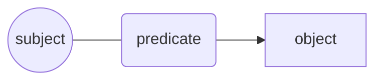
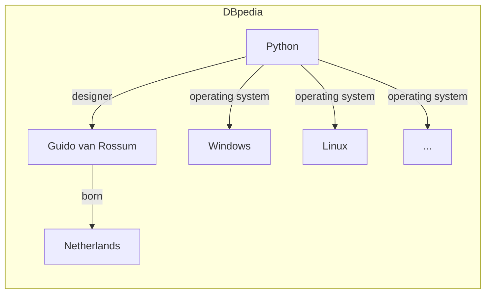
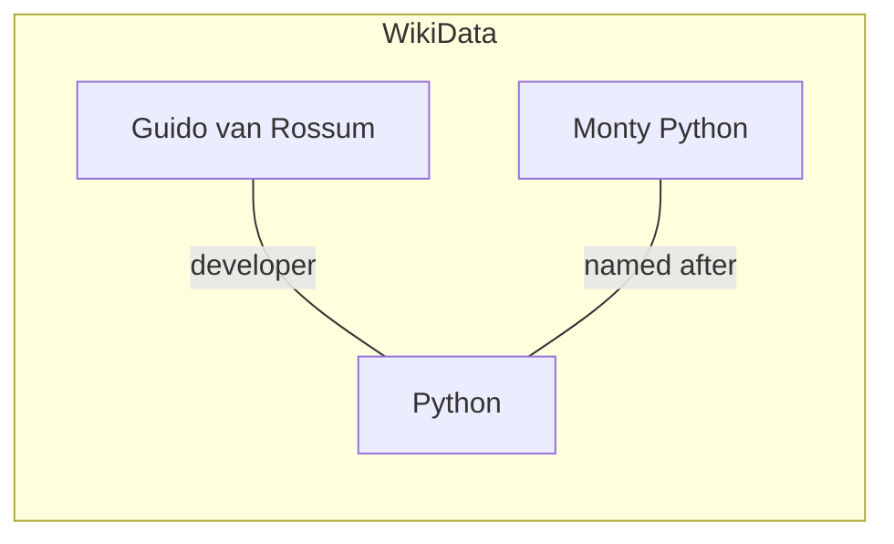
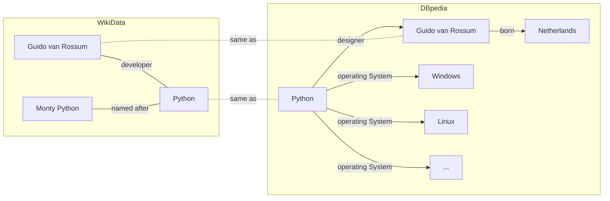
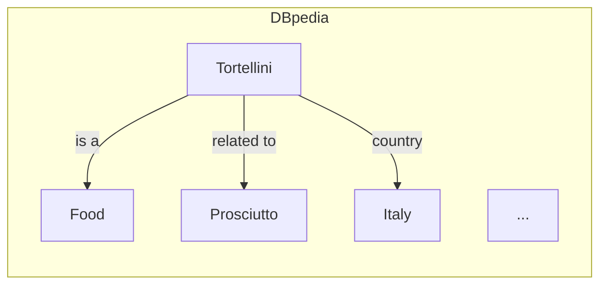

# Knowledge Management 101

## Agenda

- Knowledge management
- Semantics what?
- Triples & co
- Attaching semantics
- Graph databases
- JsonLD

*Beware*: commands may contain small typos. You have to fix them to properly complete the course!

----

Prerequisites:

- json, yaml, xmlschema
- HTTP, OpenAPI 3
- SQL and database hints

---

## Intro: What is knowledge?

Knowledge is a set of information that is useful for a given purpose.

We express knowledge through language and symbols
in various forms: text, images, and sounds.

To use knowledge we need to:

- sense;
- interpret;
- understand.

When reading a book, for example, we not only need to read and understand the words,
but also to interpret the meaning of the sentences and paragraphs
based on the context and our previous knowledge.

----

## Intro: The Encyclopedia

The Encyclopedia was one of the first attempts to organize knowledge,
and to make it available to the public.

Encyclopedia voices can be basically seen as a collection of sentences,
each of the form



----

For example, an hypotetical Python encyclopedia voice
could be:

> Python is a programming language
> \n designed by Guido van Rossum and
> \n named after the Monty Python comedy group.

----

Today, we have various encyclopedias on the web,
such as Wikipedia and dbpedia.

Exercise:

1. open the "Python" page on dbpedia:

   - <https://dbpedia.org/page/Python_(programming_language)>

   and on Wikidata:

   - <https://www.wikidata.org/wiki/Q28865>

2. note that in both sites every
   piece of information is expressed in couples
   such as "predicate" and "object".

3. navigate those pages and
   click on the links to see how
   the information is organized.

----

## Intro: The Encyclopedia

Since we can represent sentences as graphs,
it is natural to represent and organize knowledge
in a graph structure,
where each node is a concept and the edges are the relationships between them.

Here is an excerpt from the Python encyclopedia voice of Dbpedia:



----

Another example is the Python encyclopedia voice of Wikidata:



----

We can use further knowledge - using exisiting cross-references
between Dbpedia and Wikidata,
or using our own knowledge -
to connect the two graphs together.



This is the basis of the Semantic Web,
where knowledge is represented in a machine-readable format.

But it is also the basis of the Web itself
(e.g., see [Web Linking RFC 8288](https://datatracker.ietf.org/doc/html/rfc8288)).

----

## Machine readable sentences and RDF

Encyclopedia voices on Wikipedia and dbpedia are expressed in
[Resource Description Framework (RDF)](https://www.w3.org/TR/rdf11-primer/).

It is a formal language to represent knowledge in a machine-readable format
using triples of the form

```text
subject predicate object .
```

:exclamation: note the dot at the end of the sentence :exclamation:

```python
# rdflib is a python library to work with RDF.
%pip install rdflib
```

----

Subjects and predicates are uniquely identified by [URIs](https://www.w3.org/TR/rdf11-concepts/#section-uris),
and objects can be either URIs or literals (strings, numbers, dates, etc.).

URIs provide a definition context for subjects and predicates,
and allow to disambiguate their meaning depending on the
definition provided by a given vocabulary.

Every term is identified by an absolute URI
enclosed by `<>`.

```python
sentences = """
<https://dbpedia.org/data/Tortellini> a <https://dbpedia.org/ontology/Food> .
"""
```

----

Let's parse our first RDF sentence using the [rdflib](https://rdflib.readthedocs.io/en/stable/) library.

```python
from rdflib import Graph

g = Graph()
g.parse(data=sentences, format="turtle")

print(*g, sep="\n")
```

----

We can also represent the same sentence in JSON-LD format.

```python
json_text = g.serialize(format="application/ld+json")
print(json_text)
```

Exercise: take 2 minutes to map the JSON-LD
format to the RDF format.

We'll see JSON-LD in detail later.

---

### Namespaces and cURIe

RDF use namespace prefixes to shorten URIs
(the [cURIe](https://www.w3.org/TR/curie/) syntax).

```python
sentences = """
@prefix dbr: <http://dbpedia.org/resource/> .
@prefix dbo: <http://dbpedia.org/ontology/> .

dbr:Tortellini a dbo:Food .
"""

g1 = Graph()
g1.parse(data=sentences, format="turtle")
print(*g1, sep="\n")
```

```python
# Get the namespaces used in the g1 graph.
g1_ns = set(g1.namespaces())
print(*g1_ns, sep="\n")
```


```python
# Expand an entry using predefined namespaces.
g1.namespace_manager.expand_curie("dbr:Lasagne")
```

----

Another vocabulary could provide a different definition for the same term.
:warning: URI could not always be human-readable.

```python
from rdflib import URIRef
wikidata_python = URIRef("https://www.wikidata.org/wiki/Q28865")

wikidata_python
```

----

Let's express the following English definition in RDF:

> Tortellini are a typical Italian food,
> <br>made with pasta filled with meat such as prosciutto.

We must use different sentences,
and we'll express a generic relationship
with the `dbo:WikiPageWikiLink`
predicate.

```python
sentences = """
@prefix : <http://dbpedia.org/resource/> .
@prefix dbp: <http://dbpedia.org/property/> .
@prefix dbo: <http://dbpedia.org/ontology/> .

:Tortellini a          dbo:Food .
:Tortellini dbp:country   :Italy .
:Tortellini dbo:WikiPageWikiLink :Prosciutto .
:Meat       dbo:WikiPageWikiLink :Prosciutto .
"""
```

#### Exercise: parse the sentences using rdflib and answer the following questions:

- how many sentences are there?
- how many subjects are there?
- how many namespaces are there?

```python
from rdflib import Graph

tortellini = Graph()

# Use this cell for the exercise
```

#### Exercise: use `Graph.namespaces` to get the
namespaces added by the sentences above.

```python
from rdflib import Graph

default_ns = set(Graph().namespaces())

# Use this cell for the exercise
```

#### Exercise: serialize the above graph in JSON-LD format.

```python
# Use this cell for the exercise
tortellini_jsonld = ...
```

#### Exercise: Load the JSON-LD object in a variable

- What's the type and len of the serialized object?
- What's in the first element of the serialized object?

```python
import json

# Use this cell for the exercise
...
```

#### Exercise: Get a voice from dbpedia

Now, let's get the actual voice from dbpedia.

```python
# Get a voice from dbpedia using rdflib
from rdflib import Graph
tortellini_url = "https://dbpedia.org/data/Tortellini.n3"
tortellini_n3 = Path("Tortellini.n3")

# What are Tortellini?
g = Graph()
g.parse(tortellini_url, format="turtle")
```

We get a graph with the information about Tortellini.



An encyclopedia voice contains a list of sentences :)

```python
# List all the details about Tortellini.
sentences = list(g)
excerpt = sentences[0:15]
print(*[str(s) for s in excerpt], sep="\n")
```

#### Exercise: counting sentences

- how many sentences are there?
- how many elements does each sentence have?

```python
# Use this cell for the exercise
```

----

```python
from rdflib.namespace import RDF, RDFS, FOAF

# Now we get specific properties from the graph.
_type = list(g.objects(predicate=RDF.type))
print(_type)
```

```python
from tools import plot_graph
plot_graph(g, limit=30)
```

#### Exercise: extending graphs

There's plenty of knowledge in the web!

```python
from rdflib import Graph
from rdflib.namespace import RDFS

tortellini_url = "https://dbpedia.org/data/Tortellini.n3"
tortellini_n3 = Path("Tortellini.n3")

g = Graph()
g.parse(tortellini_n3, format="n3")
plot_graph(g, limit=30, pattern=".*/dbpedia.org")
```

And we can connect them together

```python
tagliatelle_url = "https://dbpedia.org/data/Tagliatelle.n3"
tagliatelle_n3 = Path("Tagliatelle.n3")
# Extend our graph
g.parse(tagliatelle_n3, format="n3")
```

Exercise: how many sentences are there now?

```python
# Use this cell for the exercise
```

Plot the graph again to see the new nodes and
their relations.

```python
plot_graph(g, label_property=RDFS.label, limit=50, pattern=".*/dbpedia.org")
```
