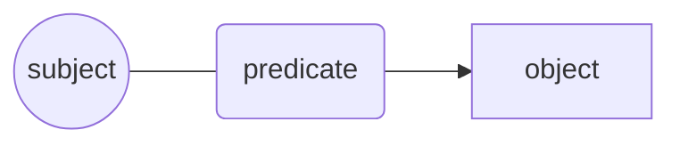
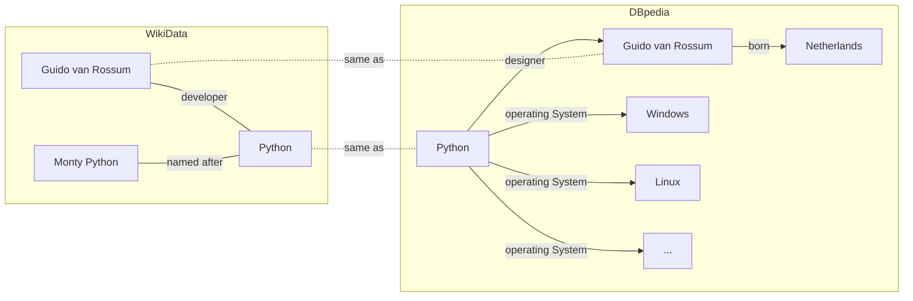
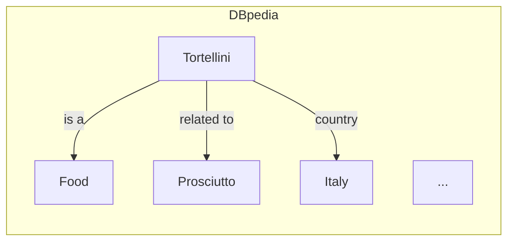

# Knowledge Management 101

## Agenda

- Knowledge management
- Semantics what?
- Triples & co
- Attaching semantics
- Graph databases
- JsonLD

*Beware*: commands may contain small typos. You have to fix them to properly complete the course!

----

Prerequisites:

- json, yaml, xmlschema
- HTTP, OpenAPI 3
- SQL and database hints

---

## Intro: What is knowledge?

Knowledge is a set of information that is useful for a given purpose.

We express knowledge through language and symbols
in various forms: text, images, and sounds.

To use knowledge we need to:

- sense;
- interpret;
- understand.

When reading a book, for example, we not only need to read and understand the words,
but also to interpret the meaning of the sentences and paragraphs
based on the context and our previous knowledge.

----

## Intro: The Encyclopedia

The Encyclopedia was one of the first attempts to organize knowledge,
and to make it available to the public.

Encyclopedia voices can be basically seen as a collection of sentences,
each of the form



----

For example, an hypotetical Python encyclopedia voice
could be:

> Python is a programming language
> designed by Guido van Rossum and
> named after the Monty Python comedy group.

----

Today, we have various encyclopedias on the web,
such as Wikipedia and dbpedia.

Exercise: open the "Python" page on dbpedia:

- <https://dbpedia.org/page/Python_(programming_language)>

And on Wikidata:

- <https://www.wikidata.org/wiki/Q28865>

----

## Intro: The Encyclopedia

Since we can represent sentences as graphs,
it is natural to represent and organize knowledge
in a graph structure,
where each node is a concept and the edges are the relationships between them.



This is the basis of the Semantic Web,
where knowledge is represented in a machine-readable format,
but it is also the basis of the Web itself
(e.g., see [Web Linking RFC 8288](https://datatracker.ietf.org/doc/html/rfc8288)).

----

## Intro: The Encyclopedia

Encyclopedia voices on Wikipedia and dbpedia are expressed in
[Resource Description Framework (RDF)](https://www.w3.org/TR/rdf11-primer/).

It is a formal language to represent knowledge in a machine-readable format
using triples of the form

```text
subject predicate object .
```

:warning: note the dot at the end of the sentence!

----

Subjects and predicates are uniquely identified by URIs,
and objects can be either URIs or literals (strings, numbers, dates, etc.).

URIs provide a definition context for subjects and predicates,
and allow to disambiguate their meaning depending on the
definition provided by a given vocabulary.

Every term is identified by an absolute URI
enclosed by `<>`.

```turtle
<https://dbpedia.org/data/Tortellini> a <https://dbpedia.org/ontology/Food> .
```

RDF allows the use of prefixes to shorten URIs
( the [cURIe](https://www.w3.org/TR/curie/) syntax).

```turtle
@prefix dbr: <http://dbpedia.org/resource/> .
@prefix dbo: <http://dbpedia.org/ontology/> .

dbr:Tortellini a dbo:Food .
```

----

Another vocabulary could provide a different definition for the same term,
though the URI could not always be human-readable.

```python
prefix = "https://www.wikidata.org/wiki/"
term = "Q28865"
uri = "https://www.wikidata.org/wiki/Q28865"
```

----

Let's translate the following definition from English to RDF:

> Tortellini are a typical Italian food,
> <br>made with pasta filled with meat such as prosciutto.

becomes something like

```turtle
@prefix : <http://dbpedia.org/resource/> .
@prefix dbp: <http://dbpedia.org/property/> .
@prefix dbo: <http://dbpedia.org/ontology/> .

:Tortellini a          :Food .
:Tortellini dbp:country   dbr:Italy .
:Tortellini dbo:WikiPageWikiLink :Prosciutto .
:Meat       dbo:WikiPageWikiLink :Prosciutto .
```

## Exercise: Get a voice from dbpedia

Now, let's get the actual voice from dbpedia
using the python RDF library.

```python
# Get a voice from dbpedia using rdflib
from rdflib import Graph

# What's Tortellini?
g = Graph()
g.parse("https://dbpedia.org/data/Tortellini.ttl", format="turtle")
```

We get a graph with the information about Tortellini.



An encyclopedia voice contains a list of sentences :)

```python
# List all the details about Tortellini.
sentences = list(g)

print(*[str(s) for s in sentences], sep="\n")
```

Exercise:

- how many sentences are there?
- how many elements does each sentence have?

----

```python
from rdflib.namespace import RDF, RDFS, FOAF

# Now we get specific properties from the graph.
_type = list(g.objects(predicate=RDF.type))
print(_type)
```

```python
from tools import plot_graph
plot_graph(g, label_property=RDFS.label)
```
