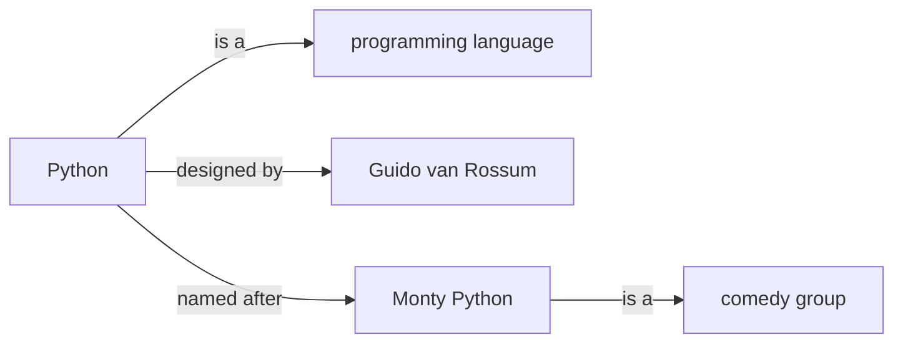
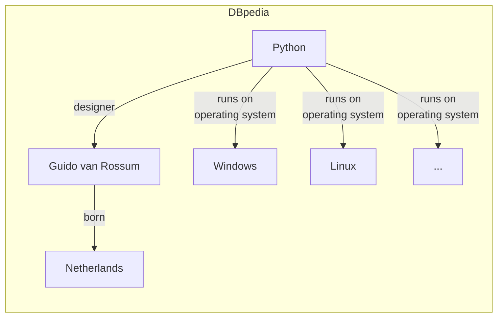
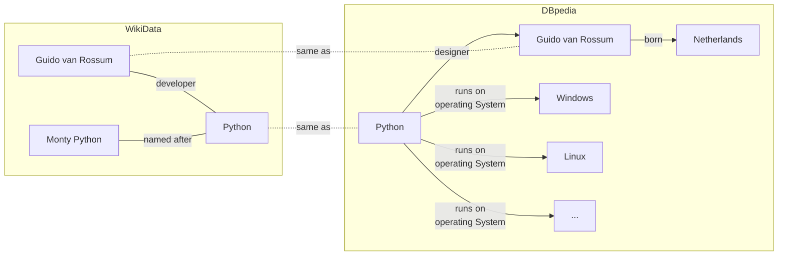

# Knowledge Management 101

## Agenda

- What is knowledge?
- Knowledge and graphs
- RDF: machine-readable knowledge

*Beware*: commands may contain small typos. You have to fix them to properly complete the course!

----

Prerequisites:

- json, yaml, xmlschema
- HTTP, OpenAPI 3
- SQL and database hints

```python
# rdflib is a python library to work with resources.
%pip install rdflib
```

---

## What is knowledge?

Knowledge is a set of information that is useful for a given purpose.

We express knowledge through language and symbols
in various forms: text, images, and sounds.

----

To use knowledge we need to:

- sense;
- interpret;
- understand.

----

When reading a book, we need to:

- read and understand the words,
- interpret the meaning of the sentences and paragraphs;
- understand the meaning of the text as a whole.

This requires an awareness of the context
and our previous knowledge.

----

## What is knowledge? The Encyclopedia

The [Encyclopédie](https://en.wikipedia.org/wiki/Encyclop%C3%A9die)
was one of the first modern attempts to organize knowledge,
and to make it available to the public.

Its voices can be basically seen as a collection of sentences,
each of the form


----

Every term is identified by an absolute URI.

The prefix identifies the vocabulary name,
and the suffix identifies the term.

```python
from rdflib import URIRef
dog_uri = URIRef("https://dbpedia.org/data/Dog")
```

We'll see how to use URIs to express knowledge.

----

For example, an hypotetical Python encyclopedia voice
could be:

> Python is a programming language
> <br> designed by Guido van Rossum and
> <br> named after the Monty Python comedy group.

----

## Knowledge and Graphs

We can represent this text as a graph

💡 The object of a sentece
can be the subject of another sentence.



----

There are various encyclopedias on the web,
such as Wikipedia and dbpedia.

💪 Exercise: web encyclopedias

1. open the "Python" page on dbpedia:

   - <https://dbpedia.org/page/Python_(programming_language)>

   and on Wikidata:

   - <https://www.wikidata.org/wiki/Q28865>

2. note that in both sites every
   piece of information is expressed in couples
   such as "predicate" and "object".

3. navigate those pages and
   click on the links to see how
   the information is organized.

----

Since we can represent sentences as graphs,
it is natural to represent and organize knowledge
in a graph structure,
where each node is a concept and the edges are the relationships between them.

Here is an excerpt from the Python encyclopedia voice of Dbpedia:



----

Another example is the Python encyclopedia voice of Wikidata:


----

## Knowledge and Graphs: The Semantic Web

We can use further knowledge - using exisiting cross-references
between Dbpedia and Wikidata,
or using our own knowledge - to connect the two graphs together.



This is the basis of the Semantic Web,
where knowledge is represented in a machine-readable format.

But it is also the basis of the Web itself
(e.g., see [Web Linking RFC 8288](https://datatracker.ietf.org/doc/html/rfc8288)).

----

## RDF: Machine Readable Knowledge

Encyclopedia voices on Wikipedia and dbpedia are expressed in
[Resource Description Framework (RDF)](https://www.w3.org/TR/rdf11-primer/).

It is a W3C formal language to
represent knowledge on the web
in a machine-readable format
using triples subject-predicate-object.

RDF has different serialization formats,
such as [Turtle](https://www.w3.org/TR/turtle/),
[JSON-LD](https://json-ld.org/),
and [XML](https://www.w3.org/TR/rdf-syntax-grammar/).

We'll use the Turtle format in this course,
where a sentence is expressed as a tripe:

`subject predicate object .`

:exclamation: note the dot at the end of the sentence :exclamation:

----

If you are familiar with SQL,
you can see a graph as a table,
where each row is a sentence.

| Subject | Predicate | Object |
|---------|-----------|--------|
| dbr:Python | rdf:type | dbo:ProgrammingLanguage |
| dbr:Python | dbo:designer | dbr:gvr |
| dbr:Python | dbo:runsOn | dbr:win |
| dbr:Python | dbo:runsOn | dbr:linux |


----

## RDF: Machine Readable Knowledge

RDF uses [URIs](https://www.w3.org/TR/rdf11-concepts/#section-uris)
to disambiguate the meaning of terms and provide semantics.

Every term is identified by an absolute URI enclosed by `<>`.

The prefix identifies the source of the term definition
(that we'll call **vocabulary**),
and the suffix identifies the term.

```python
from rdflib import URIRef
dog_uri = URIRef("https://dbpedia.org/data/Dog")
print(dog_uri.n3())
```

RDF is based on:

- **elements** (IRIs, blank nodes and literals);
- **triples** (subject-predicate-object);
- **graphs** (sets of triples).
- **vocabularies** (graphs containing terms and their definitions).

### Elements

Subjects and predicates are uniquely identified by URIs.

Objects can be either URIs or literals (strings, numbers, dates, etc.).

```python
from rdflib import URIRef, Literal, BNode

iri = URIRef("mailto:mr@test")
predicate_iri = URIRef("https://schema.org/name")
blank_node = BNode("anon")
literal = Literal("Mario Rossi")

# Serialize in the N3 format
# (Notation 3 is a compact, human-readable format for RDF)
print(iri.n3(),  blank_node.n3(), literal.n3(), sep="\n")
```

💪: RDF elements

In the cell below, create a literal with the following values
and look at its [Notation 3 (N3)](https://www.w3.org/TeamSubmission/n3/) serialization.

- `42` (integer), `42.0` (float), `"42"` (string);
- `datetime.now()` (date);

```python
from datetime import datetime
...
for value in (42, 42.0, "42", datetime.now()):
    literal = Literal(value)
    print(literal.n3())
```

### Triples

A triple represents a statement about a resource;
remember: the second element is the predicate!

```python
triple = (iri, predicate_iri, literal)
print(triple)
```

Another triple serialized in the N3 format:

```python
sentences = """
<https://dbpedia.org/data/Tortellini> a <https://dbpedia.org/ontology/Food> .
"""
```

The `a` keyword is a shorthand for the `rdf:type` predicate,
which is used to indicate the type of a resource.

The following statements are equivalent:

```python
# Serialized on multiple lines...
same_sentences = """
<https://dbpedia.org/data/Tortellini>
  <http://www.w3.org/1999/02/22-rdf-syntax-ns#type>
  <https://dbpedia.org/ontology/Food>
.
"""
```

### Graphs

A graph is a set of triples.

```python
from rdflib import Graph
g = Graph()
g.add(triple)
print(g.serialize(format="turtle"))
```

----

```python
# Create a new graph and parse the above sentences.
g = Graph()
g.parse(data=sentences, format="turtle")

print(*g, sep="\n")
```

💪 Exercise: parse sentences

Parse the `same_sentences` variable
and check the content of the graph.

----

We can also represent the same sentence in JSON-LD.

```python
json_text = g.serialize(format="application/ld+json")
print(json_text)
```

💪 Exercise: take 2 minutes to map the JSON-LD format to the Turtle format.

We'll see JSON-LD in detail later.

---

## Graphs: Namespaces and cURIe

RDF use namespace prefixes to shorten URIs
(the [cURIe](https://www.w3.org/TR/curie/) syntax).

```python
sentences = """
# The @prefix directive defines a namespace prefix
@prefix dbr: <http://dbpedia.org/resource/> .
@prefix dbo: <http://dbpedia.org/ontology/> .

dbr:Tortellini a dbo:Food .
"""

g1 = Graph()
g1.parse(data=sentences, format="turtle")
print(*g1, sep="\n")
```

```python
# Get the namespaces used in the g1 graph.
g1_ns = set(g1.namespaces())
print(*g1_ns, sep="\n")
```

```python
# Expand an entry using predefined namespaces.
g1.namespace_manager.expand_curie("dbr:Lasagne")
```

----

Another vocabulary could provide a different definition for the same term.
:warning: URI could not always be human-readable.

```python
from rdflib import URIRef
wikidata_python = URIRef("https://www.wikidata.org/wiki/Q28865")

wikidata_python
```

----

Let's express the following English definition in RDF:

> Tortellini are a typical Italian food,
> <br>made with pasta filled with meat such as prosciutto.

We must use different sentences,
and we'll express a generic relationship
with the `dbo:WikiPageWikiLink`
predicate.

```python
sentences = """
@prefix : <http://dbpedia.org/resource/> .
@prefix dbp: <http://dbpedia.org/property/> .
@prefix dbo: <http://dbpedia.org/ontology/> .

:Tortellini a          dbo:Food .
:Tortellini dbp:country   :Italy .
:Tortellini dbo:WikiPageWikiLink :Prosciutto .
:Meat       dbo:WikiPageWikiLink :Prosciutto .
"""
```

💪: parse the sentences using rdflib and answer the following questions

- how many sentences are there?
- how many subjects are there?
- how many namespaces are there?

```python
from rdflib import Graph

tortellini = Graph()

# Use this cell for the exercise
```

💪: use `Graph.namespaces` to get the namespaces added by the sentences above

```python
from rdflib import Graph

default_ns = set(Graph().namespaces())

# Use this cell for the exercise
```

💪: serialize the above graph in JSON-LD format

```python
# Use this cell for the exercise
tortellini_jsonld = ...
```

💪: Load the JSON-LD object in a variable

- What's the type and len of the serialized object?
- What's in the first element of the serialized object?

```python
import json

# Use this cell for the exercise
...
```

💪: Get a voice from dbpedia

Now, let's get the actual voice from dbpedia.

```python
# Get a voice from dbpedia using rdflib
from rdflib import Graph
tortellini_url = "https://dbpedia.org/data/Tortellini.n3"
tortellini_n3 = Path("Tortellini.n3")

# What are Tortellini?
g = Graph()
g.parse(tortellini_url, format="turtle")
```

We get a graph with the information about Tortellini.


An encyclopedia voice contains a list of sentences :)

```python
# List all the details about Tortellini.
sentences = list(g)
excerpt = sentences[0:15]
print(*[str(s) for s in excerpt], sep="\n")
```

💪: counting sentences

- how many sentences are there?
- how many elements does each sentence have?

```python
# Use this cell for the exercise
```

----

```python
from rdflib.namespace import RDF, RDFS, FOAF

# Now we get specific properties from the graph.
_type = list(g.objects(predicate=RDF.type))
print(_type)
```

```python
import tools
tools.plot_graph(g, limit=30)
```

💪: extending graphs

There's plenty of knowledge in the web!

```python
from rdflib import Graph
from rdflib.namespace import RDFS

tortellini_url = "https://dbpedia.org/data/Tortellini.n3"
tortellini_n3 = Path("Tortellini.n3")

g = Graph()
g.parse(tortellini_n3, format="n3")
tools.plot_graph(g, limit=30, pattern=".*/dbpedia.org")
```

And we can connect them together

```python
tagliatelle_url = "https://dbpedia.org/data/Tagliatelle.n3"
tagliatelle_n3 = Path("Tagliatelle.n3")
# Extend our graph
g.parse(tagliatelle_n3, format="n3")
```

Exercise: how many sentences are there now?

```python
# Use this cell for the exercise
```

Plot the graph again to see the new nodes and
their relations.

```python
import tools
tools.plot_graph(g, label_property=RDFS.label, limit=50, pattern=".*/dbpedia.org")
```
