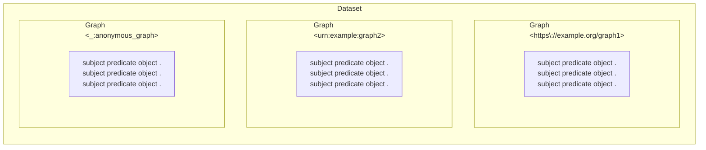
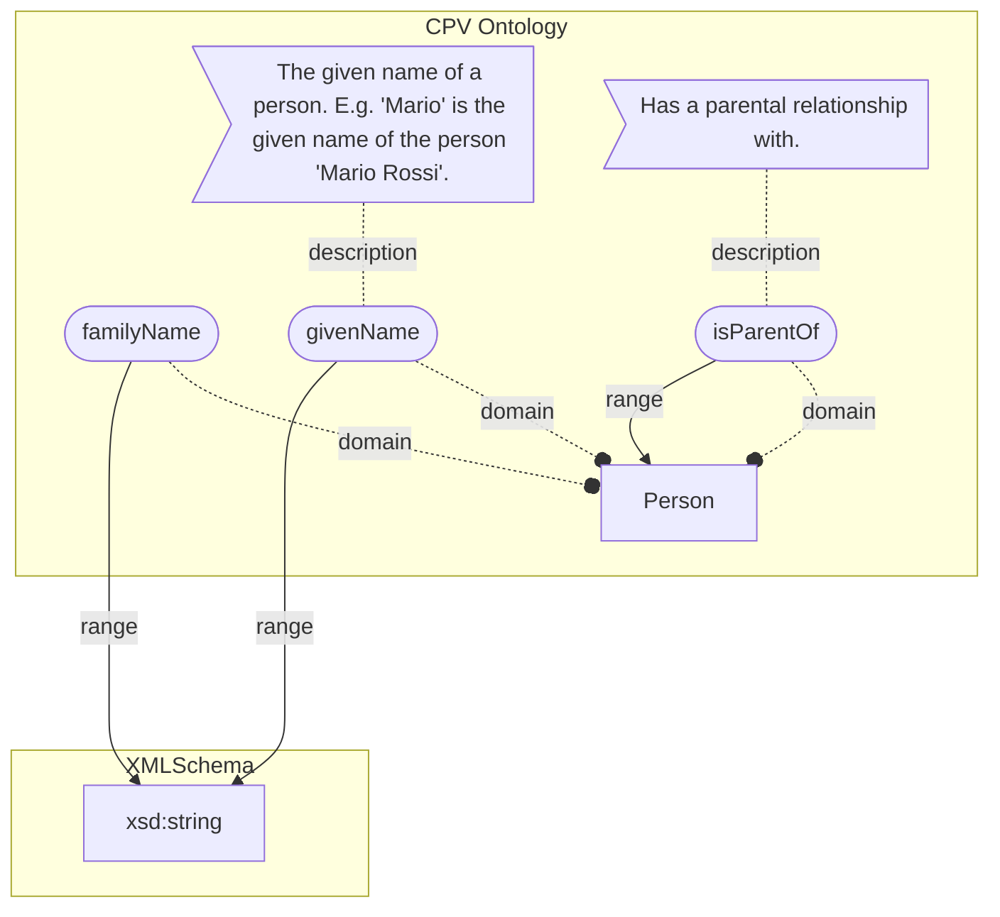

# Knowledge Management 101

## Agenda

- Semantics what?
- Triples & co
- Attaching semantics
- Graph databases
- JsonLD

*Beware*: commands may contain small typos. You have to fix them to properly complete the course!

----

## Semantics what?

Semantics: the study of meaning.

Semantics ensures that a message is understood;
messages include data and HTTP exchanges.

Here is an ambiguous message:

```yaml
name: FABIANO Romildo
income: 4_000_000
```

Is this a given name or a full name?
What is the currency of the income?
Is it a monthly or yearly income?

----

Integrating data from different sources is difficult because of the lack of semantic interoperability.


----

:exclamation: Identifiers may differ between systems,
and even registry data are not always interoperable.


----

The lack of standardization in the format and meaning of data
hinders interoperability between the databases of different organizations,
and even inside different branches of the same organization,
and therefore the creation of digital services.

A first example is the lack of syntactic interoperability:
a well-defined entity (eg. the tax code) is represented with different fields or formats:

```json
{"tax_code": "RSSMRO77T05E472W"}
{"cf": "RSSMRO77T05E472W"}
{"taxCode": "RSSMRO77T05E472W"}
```

----

Another example is semantic interoperability: the concept of family has different meanings (eg. in the fiscal domain, in the registry domain, ..):

```yaml
relatives:
  - name: Mario Rossi
    relationship: father
  - name: Carla Rossi
    relationship: sister
    cohabiting: false
```

```yaml
relatives:
  - name: Mario Rossi
    relationship: father
```

---

## Vocabularies to the rescue: RDF

RDF (Resource Description Framework) is a standard for representing information about resources in the web.
See [01-knowledge.ipynb](01-knowledge.ipynb).

Vocabularies contain a set of terms (IRIs) and their relationships
that can be used to describe the meaning of data.


----

An RDF dataset is a set of **graphs**.


----

### Graphs and RDBMS

From a relationa perspective,
you can see a dataset as a set of different tables

<_:Person>

|subject|predicate|object|
|---|---|---|
|:Mario| a | :Person|
|:Mario| givenName | "Mario"|

<_:Country>

|subject|predicate|object|
|---|---|---|
|:ITA| a | :Country|
|:ITA| name | "Italy"@en|
|:ITA| name | "Italia"@it|

Or as a single 4-ple table:

|graph|subject|predicate|object|
|---|---|---|---|
| <_:Person>|:Mario| a | :Person|
| <_:Person>|:Mario| givenName | "Mario"|
| <_:Country>|:ITA| a | :Country|
| <_:Country>|:ITA| name | "Italy"@en|
| <_:Country>|:ITA| name | "Italia"@it|


```python
from rdflib import Dataset

d = Dataset()
```

💪: dataset

- use the `Dataset.graphs` method to list the graphs in the dataset;

- add a graph to the dataset.

```python
simpsons = d.graph(identifier="_:simpsons")
simpsons.parse("simpsons.ttl", format="turtle")

```

- list the graphs in the dataset again, together with their identifiers.

<!-- len(graphs) -->
<!-- graphs = list(d.graphs()) -->

- get the `identifier` of one graph. What's its type?


<!-- [(g.identifier.n3(), type(g.identifier) ) for g in graphs] -->

Now list the graphs in the dataset:
note that the default graph does not contain triples.

```python
print(
  {k.identifier.n3(): len(k) for k in d.graphs()}
)
```

----

To semantically standardize data, services and their content,
conceptual tools such as ontologies
and controlled vocabularies (codelist, taxonomies, ..)
are used.

💪: the DBpedia ontology and dataset

Parse the following RDF sentences in a dataset.

```python
sentences = """
@prefix    : <http://dbpedia.org/resource/> .
@prefix dbp: <http://dbpedia.org/property/> .
@prefix dbo: <http://dbpedia.org/ontology/> .

# We can group together sentences with the same subject
# using `;`
:Tortellini
  # `a` is a shortcut for `rdf:type`
  a                    dbo:Food     ;
  dbp:country          :Italy       ;
  dbo:WikiPageWikiLink :Prosciutto  . # Always end with a dot

:Meat       dbo:WikiPageWikiLink :Prosciutto .
"""

# Create a new named graph in the dataset.
g = d.graph(identifier="_:my_dbpedia")
...

```


- Get the URIs representing Tortellini and Food using the `Graph.subjects`  and `Graph.objects` methods.

```python
# Deduplicate subjects using set()
subjects = set( ... )
objects = set( ... )
items = subjects | objects
print(*items, sep="\n")
```
<!-- print(set(g.subjects())) -->
- what's the namespace of the `Tortellini` URI?
- what's the namespace of the `Food` URI?
- Open both URIs in a browser and check their content,
  then try to understand the difference between
  their namespaces.

## Ontologies and controlled vocabularies

Ontologies are used to standardize the semantics of digital content.

- **Ontology**: a set of logical axioms
                that conceptualize a domain of interest
                by defining concepts (e.g., a `Person`)
                and the semantics of relationships (e.g., `isParentOf`) between them.

Example: the Italian ontology for person defines:

- the concept of person;
- its properties (e.g., givenName, familyName, isParentOf);
- the range of each property (e.g., string, date, person);
- the domain of each property (e.g., person, organization, place);
- See also <https://w3id.org/italia/onto/CPV/Person>.



- **Controlled vocabulary**: a vocabulary where the terms are validated by a designated authority.
  It can be of different types - e.g., a list (codelist), a hierarchical structure (taxonomy), a glossary and a thesaurus (which adds further constraints to a taxonomy).

Examples of European controlled vocabularies are here <https://op.europa.eu/en/web/eu-vocabularies/controlled-vocabularies>

----

## Standard vocabularies

Standard vocabularies that are used to semantically describe data
are:

- the RDF Schema (RDFS) vocabulary,
- the Web Ontology Language (OWL) vocabulary,
- and the Simple Knowledge Organization System (SKOS) vocabulary.

Here are some example IRIs described using RDFS:

```turtle
@prefix rdfs: <http://www.w3.org/2000/01/rdf-schema#> .
@prefix ex:  <http://example.org/> .

# The ex:Person Resource classifies a group of Resources.
ex:Person rdf:type rdfs:Class .

# ex:Alive classifies a group of ex:Person
ex:Alive rdf:type rdfs:Class ;
  rdfs:subClassOf ex:Person ;
  .

ex:givenName rdf:type rdf:Property ;
  rdfs:domain ex:Person ;
  rdfs:range xsd:string ;

```

You can see vocabularies as a set of globally unique labels
that can be used to describe data in a standardized way.

These labels may or may not overlap (e.g., I can use labels
from different vocabularies to describe the same data),
like in the following example:

```turtle
@prefix ex: <http://example.org/> .

ex:Person a rdfs:Class ;
  # Using RDFS vocabulary...
  rdfs:label "Person"@en, "Persona"@it ;
  rdfs:comment "A human being."@en, "Un essere umano."@it ;

  # Using SKOS vocabulary...
  a skos:Concept ;
  skos:prefLabel "Person"@en, "Persona"@it ;
  skos:definition "A human being."@en, "Un essere umano."@it
.
```

## Ontologies in Italy

In Italy, <https://schema.gov.it> is the National Data Catalog for Semantic Interoperability.

It contains Controlled Vocabularies and Ontologies,
including the Italian Ontology for Person (CPV),
that we can use to uniquely describe someone.

```turtle
@prefix CPV: <https://w3id.org/italia/onto/CPV> .

<email:robipolli@gmail.com>
  CPV:givenName "Roberto" ;
  CPV:familyName "Polli" .

```

----

An ontology is defined by a set of IRIs and their relationships.

```python
from rdflib import Graph

sentences = """
@prefix xsd:  <http://www.w3.org/2001/XMLSchema#> .
@prefix dct:  <http://purl.org/dc/terms/> .
@prefix rdfs: <http://www.w3.org/2000/01/rdf-schema#> .
@prefix owl:  <http://www.w3.org/2002/07/owl#> .


<https://w3id.org/italia/onto/CPV>
  dct:modified "2020-04-27"^^xsd:date ;
  # Use `,` to group multiple objects
  dct:title    "Person Ontology"@en,
               "Ontologia delle persone"@it .

<https://w3id.org/italia/onto/CPV/Person>
  a rdfs:Class ;
  rdfs:isDefinedBy <https://w3id.org/italia/onto/CPV> ;
  rdfs:comment "An individual human being .."@en .

# An ontology defines the meaning of predicates.
<https://w3id.org/italia/onto/CPV/givenName>
  a owl:DatatypeProperty ;
  rdfs:isDefinedBy <https://w3id.org/italia/onto/CPV> ;
  rdfs:comment "The given name of a person. E.g. 'Mario' is the given name of the person 'Mario Rossi'."@en ;
  rdfs:label  "given name"@en ;
  rdfs:domain <https://w3id.org/italia/onto/CPV/Person> ;
  rdfs:range xsd:string .

"""

```
<!-- g = Graph() -->
<!-- g.parse(data=sentences, format="turtle") -->
<!-- print(*g, sep="\n") -->
<!-- len(list(g)) -->

Exercise: how many triples are in the graph?

```python
import tools

tools.plot_graph(g)
```
