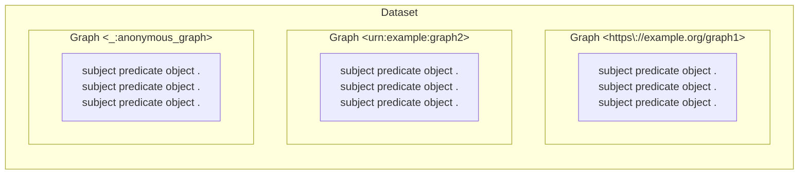
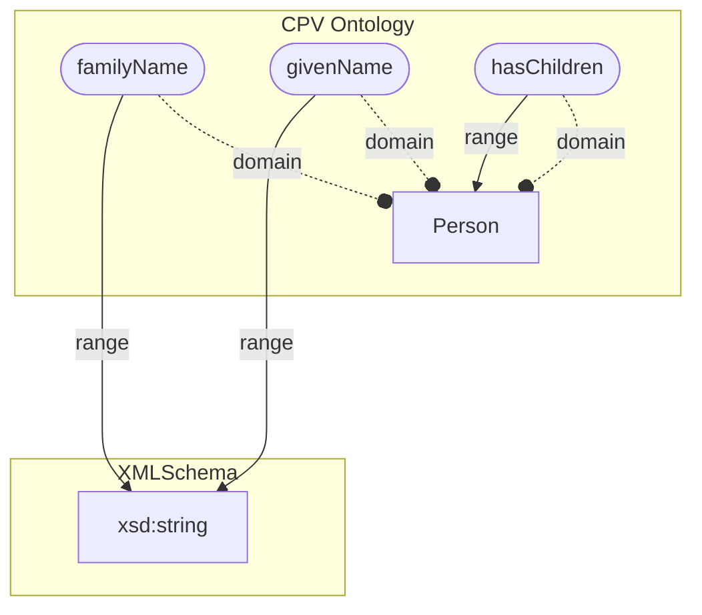

# Knowledge Management 101

## Agenda

- Semantics what?
- Triples & co
- Attaching semantics
- Graph databases
- JsonLD

*Beware*: commands may contain small typos. You have to fix them to properly complete the course!

----

## Semantics what?

Semantics: the study of meaning.

Semantics ensures that a message is understood;
messages include data and HTTP exchanges.

Here is an ambiguous message:

```yaml
name: FABIANO Romildo
income: 4_000_000
```

Is this a given name or a full name?
What is the currency of the income?
Is it a monthly or yearly income?

----

Integrating data from different sources is difficult because of the lack of semantic interoperability.


----

:exclamation: Identifiers may differ between systems,
and even registry data are not always interoperable.


----

The lack of standardization in the format and meaning of data
hinders interoperability between the databases of different organizations,
and even inside different branches of the same organization,
and therefore the creation of digital services.

A first example is the lack of syntactic interoperability:
a well-defined entity (eg. the tax code) is represented with different fields or formats:

```json
{"tax_code": "RSSMRO77T05E472W"}
{"cf": "RSSMRO77T05E472W"}
{"taxCode": "RSSMRO77T05E472W"}
```

----

Another example is semantic interoperability: the concept of family has different meanings (eg. in the fiscal domain, in the registry domain, ..):

```yaml
relatives:
  - name: Mario Rossi
    relationship: father
  - name: Carla Rossi
    relationship: sister
    cohabiting: false
```

```yaml
relatives:
  - name: Mario Rossi
    relationship: father
```

---

## Vocabularies to the rescue: Controlled vocabularies

Controlled Vocabularies use URIs to disambiguate the meaning of terms and provide semantics.

Every term is identified by an absolute URI.

The prefix identifies the vocabulary name,
and the suffix identifies the term.

```python
from rdflib import URIRef
dog_uri = URIRef("https://dbpedia.org/data/Dog")
```

## Vocabularies to the rescue: RDF

RDF: Resource Description Framework

It allows to represent information on the web based on:

- **elements** (IRIs, blank nodes and literals);

```python
from rdflib import URIRef, Literal, BNode

iri = URIRef("mailto:mr@test")
iri2 = URIRef("https://schema.org/name")
blank_node = BNode("anon")
literal = Literal("Mario Rossi")

# Serialize in the N3 format
# (Notation 3 is a compact, human-readable format for RDF)
print(iri.n3(),  blank_node.n3(), literal.n3(), sep="\n")
```

Exercise: RDF elements

In the cell below, create a literal with the following values
and look at its [Notation 3 (N3)](https://www.w3.org/TeamSubmission/n3/) serialization.

- `42` (integer), `42.0` (float), `"42"` (string);
- `datetime.now()` (date);

```python
from datetime import datetime
...
for value in (42, 42.0, "42", datetime.now()):
    literal = Literal(value)
    print(literal.n3())
```

- **triples** (subject-predicate-object);

```python
triple = (iri, iri2, literal)
print(triple)
```

- **graphs** (sets of triples).

```python
from rdflib import Graph
g = Graph()
g.add(triple)
print(g.serialize(format="turtle"))
```

and on **vocabularies** of elements identified by IRIs and namespaces.

----

An RDF dataset is a set of **graphs**.



```python
from rdflib import Dataset

d = Dataset()
```

#### Exercise: dataset

- use the `Dataset.graphs` method to list the graphs in the dataset;

- add a graph to the dataset.

```python
simpsons = d.graph(identifier="urn:example:simpsons")
simpsons.parse("simpsons.ttl", format="turtle")

```

- list the graphs in the dataset again, together with their identifiers.

<!-- len(graphs) -->
<!-- graphs = list(d.graphs()) -->

- get the `identifier` of one graph. What's its type?


<!-- [(g.identifier.n3(), type(g.identifier) ) for g in graphs] -->
----

To semantically standardize data, services and their content,
conceptual tools such as ontologies
and controlled vocabularies (codelist, taxonomies, ..)
are used.

#### Exercise: the DBpedia ontology and dataset

Parse the following RDF sentences in a dataset.

```python
sentences = """
@prefix    : <http://dbpedia.org/resource/> .
@prefix dbp: <http://dbpedia.org/property/> .
@prefix dbo: <http://dbpedia.org/ontology/> .

# We can group together sentences with the same subject
# using `;`
:Tortellini
  # `a` is a shortcut for `rdf:type`
  a                    dbo:Food     ;
  dbp:country          :Italy       ;
  dbo:WikiPageWikiLink :Prosciutto  . # Always end with a dot

:Meat       dbo:WikiPageWikiLink :Prosciutto .
"""

# Create a new named graph in the dataset.
g = d.graph(identifier="urn:my_dbpedia")
...

```


- Get the URIs representing Tortellini and Food using the `Graph.subjects`  and `Graph.objects` methods.

```python
# Deduplicate subjects using set()
subjects = set( ... )
objects = set( ... )
print(subjects | objects)
```
<!-- print(set(g.subjects())) -->
- what's the namespace of the `Tortellini` URI?
- what's the namespace of the `Food` URI?
- Open both URIs in a browser and check their content,
  then try to understand the difference between
  their namespaces.

## Ontologies and controlled vocabularies

Ontologies are used to standardize the semantics of digital content.

- **Ontology**: an ontology is a set of logical axioms that conceptualize a domain of interest by defining concepts and the semantics of relationships between them.

Example: the Italian ontology for person defines:

- the concept of person;
- its properties (e.g., givenName, familyName, hasChildren);
- the range of each property (e.g., string, date, person);
- the domain of each property (e.g., person, organization, place);
- See also <https://w3id.org/italia/onto/CPV/Person>.




- **Controlled vocabulary**: a vocabulary where the terms are validated by a designated authority.
  It can be of different types - e.g., a list (codelist), a hierarchical structure (taxonomy), a glossary and a thesaurus (which adds further constraints to a taxonomy).

Examples of European controlled vocabularies are here <https://op.europa.eu/en/web/eu-vocabularies/controlled-vocabularies>

----

## Ontologies in Italy

In Italy, there's <https://schema.gov.it>, a National Data Catalog for Semantic Interoperatbility
containing the official ontology for person
(Common Person Vocabulary) that we can use to uniquely describe someone.

```text
@prefix CPV: <https://w3id.org/italia/onto/CPV> .

<email:robipolli@gmail.com>
  CPV:givenName "Roberto" ;
  CPV:familyName "Polli" .

```

----

An ontology is defined by a set of IRIs and their relationships.

```python
from rdflib import Graph

sentences = """
@prefix xsd:  <http://www.w3.org/2001/XMLSchema#> .
@prefix dct:  <http://purl.org/dc/terms/> .

<https://w3id.org/italia/onto/CPV>
  dct:modified "2020-04-27"^^xsd:date ;
  # Use `,` to group multiple objects
  dct:title    "Person Ontology"@en,
               "Ontologia delle persone"@it .

# An ontology defines the meaning of predicates.
<https://w3id.org/italia/onto/CPV/givenName>
  rdfs:comment "The given name of a person. E.g. 'Mario' is the given name of the person 'Mario Rossi'."@en ;
  rdfs:label  "given name"@en ;
  rdfs:range xsd:string .

"""

```
<!-- g = Graph() -->
<!-- g.parse(data=sentences, format="turtle") -->
<!-- print(*g, sep="\n") -->
<!-- len(list(g)) -->

Exercise: how many triples are in the graph?
