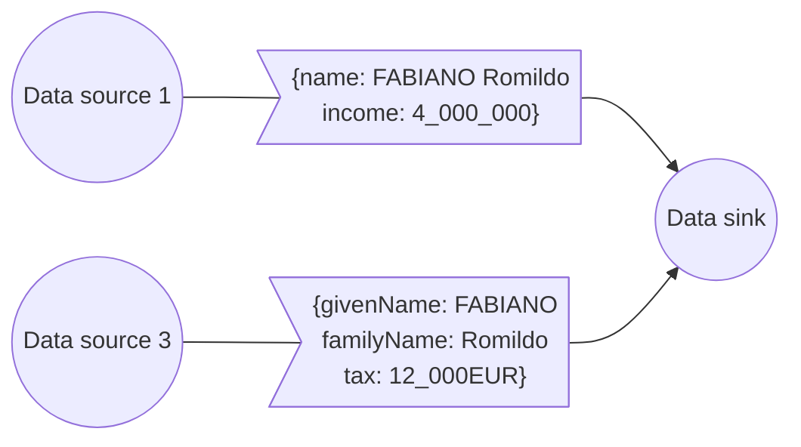
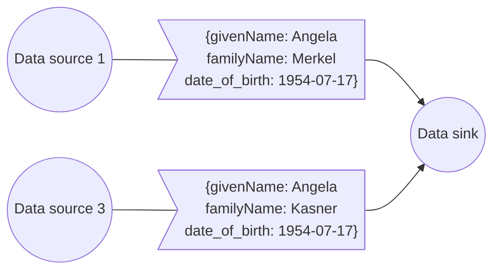

# Knowledge Management 101

## Agenda

- Knowledge management
- Semantics what?
- Triples & co
- Attaching semantics
- Graph databases
- JsonLD

*Beware*: commands may contain small typos. You have to fix them to properly complete the course!

----

## Intro: Semantics what?

Semantics: the study of meaning.

Semantics ensures that a message is understood;
messages include data and HTTP exchanges.

Here is an ambiguous message:

```yaml
name: FABIANO Romildo
income: 4_000_000
```

Is this a given name or a full name?
What is the currency of the income?
Is it a monthly or yearly income?

----

Integrating data from different sources is difficult because of the lack of semantic interoperability.



----

:exclamation: Identifiers may differ between systems,
and even registry data are not always interoperable.



----

The lack of standardization in the format and meaning of data
hinders interoperability between the databases of different organizations,
and even inside different branches of the same organization,
and therefore the creation of digital services.

A first example is the lack of syntactic interoperability:
a well-defined entity (eg. the tax code) is represented with different fields or formats:

```
{"tax_code": "MRORSS77T05E472W"}
{"cf": "mrorss77T05E472W"}
{"taxCode": "MRORSS77T05E472W"}
```

----

Another example is semantic interoperability: the concept of family has different meanings (eg. in the fiscal domain, in the registry domain, ..):

```yaml
relatives:
  - name: Mario Rossi
    relationship: father
  - name: Carla Rossi
    relationship: sister
    cohabiting: false
```

```yaml
relatives:
  - name: Mario Rossi
    relationship: padre
```

---

## Vocabularies to the rescue

Controlled Vocabularies use URIs to disambiguate the meaning of terms and provide semantics.

Every term is identified by an absolute URI.

The prefix identifies the vocabulary name,
and the suffix identifies the term.

```python
from rdflib import URIRef
dog_uri = URIRef("https://dbpedia.org/data/Dog")

```


### RDF: Resource Description Framework

It allows to represent information on the web based on two data structures:

- **elements** (IRIs, blank nodes and literals);
- **triples** (subject-predicate-object);
- **graphs** (sets of triples).

and on **vocabularies** of elements identified by IRIs and namespaces.

An RDF dataset is a set of **graphs**.

----

To semantically standardize data, services and their content,
conceptual tools such as ontologies
and controlled vocabularies (codelist, taxonomies, ..)
are used.

#### Exercise: the DBpedia ontology and dataset

Read the following RDF sentences

```python
sentences = """
@prefix : <http://dbpedia.org/resource/> .
@prefix dbp: <http://dbpedia.org/property/> .
@prefix dbo: <http://dbpedia.org/ontology/> .

:Tortellini a          dbo:Food .
:Tortellini dbp:country   :Italy .
:Tortellini dbo:WikiPageWikiLink :Prosciutto .
:Meat       dbo:WikiPageWikiLink :Prosciutto .
"""

```

- Get the URIs representing Tortellini and Food;
- what's the namespace of the `Tortellini` URI?
- what's the namespace of the `Food` URI?
- Open both URIs in a browser and check their content,
  then try to understand the difference between
  their namespaces.

### Ontologies and controlled vocabularies

To standardize the semantics of digital content,
we use ontologies.

- **Ontology**: an ontology is a set of logical axioms that conceptualize a domain of interest by defining concepts and the semantics of relationships between them.

- **Controlled vocabulary**: a vocabulary where the terms are validated by a designated authority.
  It can be of different types - e.g., a list (codelist), a hierarchical structure (taxonomy), a glossary and a thesaurus (which adds further constraints to a taxonomy).

Examples of European controlled vocabularies are here <https://op.europa.eu/en/web/eu-vocabularies/controlled-vocabularies>

----

#### Ontologies

In Italy, there's the official ontology of person
(Common Person Vocabulary) that we can use to uniquely describe someone.

```turtle
@prefix cpv: <https://w3id.org/italia/onto/CPV> .

<email:robipolli@gmail.com> cpv:givenName "Roberto" .
<email:robipolli@gmail.com> cpv:familyName "Polli" .

```

----

An ontology is defined by a set of IRIs and their relationships.

```turtle
@prefix xsd:   <http://www.w3.org/2001/XMLSchema#> .
@prefix dct:   <http://purl.org/dc/terms/> .

https://w3id.org/italia/onto/CPV dct:modified  "2020-04-27"^^xsd:date ;
https://w3id.org/italia/onto/CPV dct:title     "Person Ontology"@en,
                                               "Ontologia delle persone"@it ;

```
