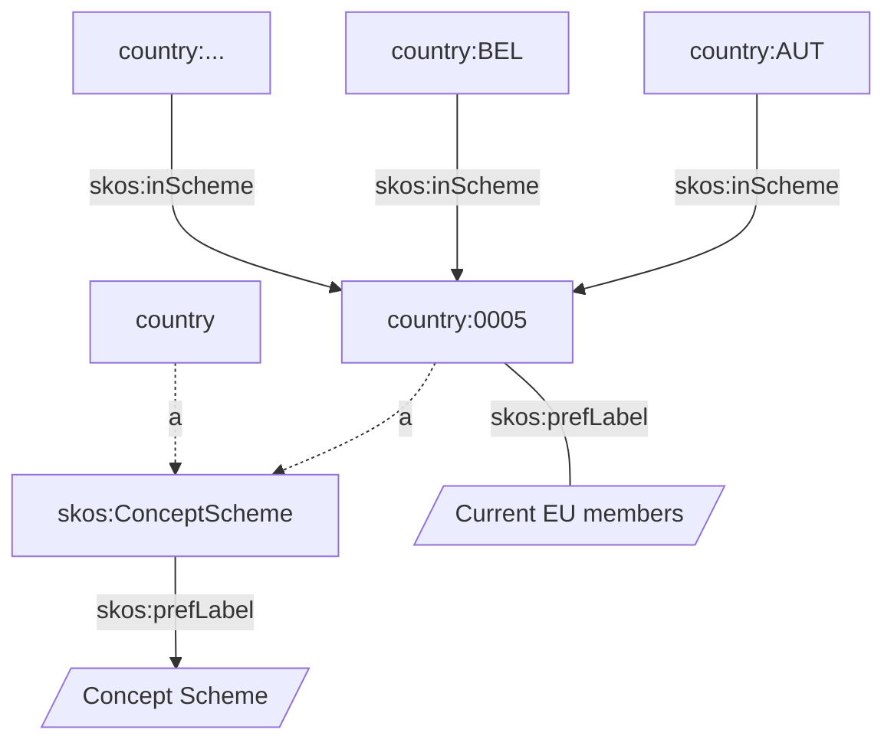

# Graph databases & SparQL

## Agenda

  - Storing and retrieving triples
  - Virtuoso
  - GraphDB

*Beware*: commands may contain small typos. You must fix them to properly complete the course!

----

Prerequisites:

- JSON, YAML, xmlschema
- HTTP, OpenAPI 3
- SQL and database hints


---

## Graphs (again)

### RDF databases

An RDF graph is an (unordered) set of triples.

Each triple consists of a `subject`, `predicate`, `object`.

Graph databases such as [Virtuoso (opensource)](https://virtuoso.openlinksw.com/),
[GraphDB (proprietary)](),
[Amazon Nepture (proprietary SaaS)]()
store triples into graphs.

They can be queried using the [SparQL]() language.

----

A sparql query retrieves all entries
matching one or more sentences

```sparql
SELECT * WHERE {
  ?subject ?predicate ?object .
  # ... more sentences ...
}
```

This workshop provides a non-exhaustive introduction to SparQL.

----

### Non-RDF databases

Other databases - [Neo4j (opensource)]()
use a different approach to represent graphs
such as [Labeled Property Graphs](https://en.wikipedia.org/wiki/Labeled_property_graph)
Neo4j can be queried using the [Cypher](https://neo4j.com/developer/cypher-query-language/) language.


Neo4j supports RDF datasets via the Neosemantics plugin.

---

## My first SparQL query

We will simulate a graph database using
[rdflib](https://rdflib.readthedocs.io/en/stable/index.html),
that supports SparQL queries.

Let's create a graph
and load into it the [European vocabulary for countries](countries.ttl).

See also:

- [EU Authority Tables](https://op.europa.eu/en/web/eu-vocabularies/authority-tables)

```python
from rdflib import Graph

# Let's create a graph.
g = Graph()

# And load into it the European
# vocabulary for countries.
g.parse("countries.ttl", format="text/turtle")
```

Now let's run our first SparQL query!

```python
# List the first 3 triples.
q = """
SELECT * WHERE {
  ?subject ?predicate ?object .
}
LIMIT 3
"""
result = g.query(q)

# Print it!
for r in result:
  print(r.asdict())
```

Now print the result using
variable names.

```python
for r in result:
    print(r.subject, r.predicate, r.object, sep="\t")
```

Exercise:

- Replace `?subject` with `?foo`
  and see what happens.

```python
q = """
WRITEME!
"""
result = g.query(q)

# Print it!
for r in result:
  print(r.asdict())
```

- Remove the `LIMIT` clause.
  How many triples are in the graph?

```python
# Use this cell for the exercise.
```

---

## Metadata, Metadata

Between all triples,
some contain metadata,
such as the type of the subjects.

```python
q = """
SELECT DISTINCT
  ?type
WHERE {
  ?s a ?type .
}
"""
result = g.query(q)

[r.type  for r in result]
```

We can simplify the above query
avoiding gathering `?s` at all
using the `[]` syntax
that matches anything.

```python
q = """
SELECT DISTINCT
  ?type
WHERE {
  [] a ?type .
}
"""
result = g.query(q)

[r.type  for r in result]
```

Exercise:

- what's a `skos:Concept`?
- what's a `skos:ConceptScheme`?

<!-- Open the URIRef in your browser -->

----

List `skos:ConceptScheme`s
and their labels.

```python
q = """
SELECT DISTINCT *
WHERE {
  ?ConceptScheme
    a skos:ConceptScheme  ;
    skos:prefLabel ?label .
    # Only English labels
    FILTER (lang(?label) = "en")
}
"""
result = g.query(q)
[r.asdict() for r in result]
```

Exercise:

- Rewrite the above query using
  two sentences.

<!-- SELECT DISTINCT * WHERE { ?ConceptScheme a skos:ConceptScheme . ?ConceptScheme skos:prefLabel ?label . } -->

----

Now find all the triples
where the `object` is
`<http://publications.europa.eu/resource/authority/country/0005>


```python
q = """
SELECT DISTINCT *
WHERE {
  ?s ?p <http://publications.europa.eu/resource/authority/country/0005> .
}
"""
result = g.query(q)
[r.asdict() for r in result]
```

Exercise:

- Rewrite the above query using
  the PREFIX directive.

<!-- PREFIX euvoc: <http://publications.europa.eu/resource/authority/country/> -->
<!-- SELECT DISTINCT * WHERE { ?s ?p euvoc:0005 } LIMIT 6-->

```python
q = """
PREFIX euvoc: <http://publications.europa.eu/resource/authority/country/>

SELECT DISTINCT *
WHERE {
  ?s ?p ...
}
LIMIT 6
"""
result = g.query(q)
[r.asdict() for r in result]
```

---

Let's visualize the graph
using:

- dotted lines to represent type relations
- parallelograms to represent literals



---

Now, query for the information
associated with the `country:AUT` node.

```python
q = """
PREFIX euvoc: <http://publications.europa.eu/resource/authority/country/>

SELECT DISTINCT *
WHERE {
  country:AUT ?p ?o .

  # Remove blank nodes.
  FILTER(!isBlank(?o))

}
"""

result = g.query(q)
print(*[(r.p.n3(), r.o.n3()) for r in result],sep="\n")
```

Exercise:

- query all skos:Schemes and their labels
  where `country:AUT`
- Hint: use two distinct sentences

<!-- SELECT DISTINCT * WHERE { country:AUT skos:inScheme ?o . ?o skos:prefLabel ?l . } -->

---

**A knowledge graph contains both data and the associated metadata.**
**There isn't a fixed schema, but a set of relations.**
**The actual schema is defined by the ontology and may evolve over time.**

---


SparQL can then be used to correlate
entries using semantically defined
vocabularies such as FOAF.

```sparql
@prefix foaf:  <http://xmlns.com/foaf/0.1/> .

SELECT * WHERE {
  ?s foaf:name ?o
}
```

| s | o |
| --- | --- |
| <mail:r@x.it> | "Roberto"|
| <mail:j@x.it> | "Jon"|

In this case `foaf:name` has a very specific meaning.
You don't need to create indexes in your database
to search for specific predicates.

----

Graph databases have an inference engine that can be used
to process complex queries.

```sparql
@prefix foaf:  <http://xmlns.com/foaf/0.1/> .

SELECT * WHERE {
  ?s foaf:knows ?o
```

| s | o |
| --- | --- |
| r@example | j@example |

----

And using multiple lines we can infer things
such as friend-of-a-friend emails.

```sparql
@prefix foaf:  <http://xmlns.com/foaf/0.1/> .

SELECT DISTINCT ?mail1, ?mail3 WHERE {
  ?user1 foaf:knows ?user2
  . ?user2 foaf:knows ?user3

  . ?user1 foaf:mbox ?mail1
  . ?user3 foaf:mbox ?mail3
```

Note that the query describes each relation
ignoring the way data is stored.

---

# Querying DBPedia

[DBPedia](https://dbpedia.org/sparql) is a graph database with a lot of data inside.

We can use it to learn sparql.

- list concepts

```
select distinct ?Concept where {[] a ?Concept} LIMIT 20
```

----

Now we want to list all `Person`

```sparql
@prefix foaf: <http://xmlns.com/foaf/0.1/> .

SELECT DISTINCT * WHERE {
  ?s a foaf:Person
} LIMIT 10
```

----

All `Person`s born in Pisa

```sparql

@prefix foaf: <http://xmlns.com/foaf/0.1/> .
@prefix dbp: <http://dbpedia.org/property/> .
@prefix dbr: <http://dbpedia.org/resource/> .

select distinct * where {
  ?s a foaf:Person .
  ?s dbp:birthPlace dbr:Pisa
} LIMIT 10

```

... with their deathplaces

```sparql
@prefix foaf: <http://xmlns.com/foaf/0.1/> .
@prefix dbp: <http://dbpedia.org/property/> .
@prefix dbr: <http://dbpedia.org/resource/> .
@prefix dbo: <http://dbpedia.org/ontology/> .


select distinct * where {
?s a foaf:Person .
?s dbp:birthPlace dbr:Pisa .
?s dbp:deathPlace ?death_place
} LIMIT 10
```

----

If deathplace is in UK

```sparql

@prefix foaf: <http://xmlns.com/foaf/0.1/> .
@prefix dbp: <http://dbpedia.org/property/> .
@prefix dbr: <http://dbpedia.org/resource/> .
@prefix dbo: <http://dbpedia.org/ontology/> .

select distinct * where {
  ?s a foaf:Person .
  ?s dbp:birthPlace dbr:Rome .
  ?s dbp:deathPlace ?deathPlace .
  ?deathPlace dbo:country dbr:United_Kingdom
} LIMIT 50

```

----

We can extend the search to every person
born in Italy and dead in UK:

- replacing `dbr:Rome` with `?birth_place`
- restricting `?birth_place` to `dbr:Italy`

```sparql
@prefix foaf: <http://xmlns.com/foaf/0.1/> .
@prefix dbp: <http://dbpedia.org/property/> .
@prefix dbr: <http://dbpedia.org/resource/> .
@prefix dbo: <http://dbpedia.org/ontology/> .

SELECT DISTINCT * WHERE {

?s a foaf:Person .
?s dbp:birthPlace ?birth_place .
?s dbp:deathPlace ?deathPlace .

?deathPlace dbo:country dbr:United_Kingdom .
?birth_place dbo:country dbr:Italy

} LIMIT 50
```

----

There's no limit to the inference, for example
we could require that the birthplace of that
person should match the one of a Pope.

```sparql
@prefix foaf: <http://xmlns.com/foaf/0.1/> .
@prefix dbp: <http://dbpedia.org/property/> .
@prefix dbr: <http://dbpedia.org/resource/> .
@prefix dbo: <http://dbpedia.org/ontology/> .
@prefix rdf: <http://www.w3.org/1999/02/22-rdf-syntax-ns#> .

select distinct * where {
  ?s a foaf:Person .
  ?s dbp:birthPlace ?birth_place .
  ?birth_place dbo:country dbr:Italy .
  ?s dbp:deathPlace ?death_place .
  ?death_place dbo:country dbr:France .

  ?pope rdf:type dbo:Pope .
  ?pope dbp:birthPlace ?birth_place .  # relation with the birth_place
} LIMIT 50
```

----

Shortening sparql queries

```sparql
@prefix foaf: <http://xmlns.com/foaf/0.1/> .
@prefix dbp: <http://dbpedia.org/property/> .
@prefix dbr: <http://dbpedia.org/resource/> .
@prefix dbo: <http://dbpedia.org/ontology/> .
@prefix rdf: <http://www.w3.org/1999/02/22-rdf-syntax-ns#> .

select distinct * where {
  ?s a foaf:Person ;
     dbp:birthPlace ?birth_place ;
     dbp:deathPlace ?death_place .
  ?birth_place dbo:country dbr:Italy .
  ?death_place dbo:country dbr:France .

  ?pope rdf:type dbo:Pope ;
        dbp:birthPlace ?birth_place .  # relation with the birth_place
} LIMIT 50
```
