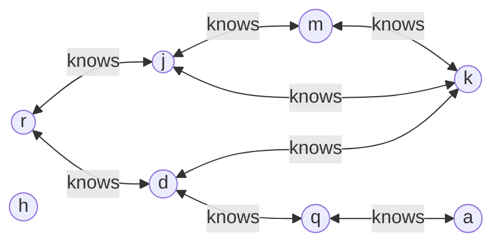

# SparQL 101

## Agenda

- Storing and retrieving triples
- Using the `rdflib.Dataset` class
- A dataset with multiple graphs
- Querying graphs
- Enriching graphs with UPDATE
- Traversing graphs with SparQL (`*` and `/` modifiers)

*Beware*: commands contain small typos. You must fix them to properly complete the course!

---

Prerequisites:

- json, yaml, xmlschema
- HTTP, OpenAPI 3
- SQL and database hints
- basics of RDF and Turtle

---

## Querying graphs with SparQL

A triple consists of a $(subject, predicate, object)$.

An RDF graph is an (unordered) set of triples:

$G = \{(s_1, p_1, o_1), (s_2, p_2, o_2), \ldots\}$.

An RDF dataset is a collection of graphs, including a $default$ graph.

$D = \{G_{default}, G_1, \ldots\}$.

$ Resources < Triples < Graph < Dataset $

SparQL is a query language for RDF datasets and graphs.

This lesson provides a non-exhaustive introduction to SparQL.

See: <https://rdflib.readthedocs.io/en/stable/apidocs/rdflib.html#dataset>

```python
from rdflib import Dataset
d = Dataset()
```

Exercise: list the graphs in the dataset.

----

A sparql query retrieves all entries
matching one or more sentences.

```python
from rdflib.query import Result

q = """
SELECT *
WHERE {
  ?subject ?predicate ?object .
  # ... more sentences ...
}
"""

# The Dataset is still empty :)
result : Result = d.query(q)
list(result)
```

----

### Storing and retrieving triples

Open [sample.ttl](sample.ttl) in another tab
and see its content.

Now load into the dataset
creating a new graph.

```python
# Create hte _:sample graph
sample = d.graph("_:sample")

# Add triples from sample.ttl
sample.parse("sample.ttl", format="text/turtle")
```

Use our utility function to print the graph.

```python
from rdflib import FOAF
import tools
tools.plot_graph(sample, label_property=FOAF.name)
```

That's what we have


List all entries from th `_:sample` graph.

```python
q = """
SELECT *
WHERE {
  ?subject ?predicate ?object .
}
LIMIT 2
"""
result : Result = sample.query(q)
[r.asdict() for r in result]
```

Exercise:

- Remove the `LIMIT` clause.
  How many triples are in the graph?
- Replace the `*` with `?subject ?predicate ?object`.
  What happens?

:warning: `SELECT`ed fields are NOT separated by commas.

```python
# Use this cell for the exercise.

# You can use variable names.
for r in result:
    print(r.subject, r.predicate, r.object, sep="\t")

```

- Replace `?subject` with `?foo`:
  what happens?

### Filtering triples

We can filter the results using:

- multiple sentences
- `FILTER` expressions

```python
q = """
SELECT
  # You can write one variable per line
  ?subject
  ?status
WHERE {
  ?subject foaf:status ?status .
}
"""
result = sample.query(q)
list(result)
```

To restrict the query to a specific resource,
you can BIND a variable to a specific value.

```python
q = """
SELECT
  ?subject
  ?status
WHERE {
  BIND(<mailto:r@example.com> AS ?subject) .

  ?subject foaf:status ?status .
}
"""
result = sample.query(q)
list(result)
```

We can use `FILTER` to restrict the results
where the ?country_name is in Italian.

```python
q = """
SELECT
  ?subject ?status
WHERE {
  BIND(<mailto:r@example.com> AS ?subject)

  ?subject foaf:status ?status .

  FILTER (lang(?status) = "it")
}

"""
result = sample.query(q)
list(result)
```

### GROUP BY triples

We can group the results using `GROUP BY`
and aggregate functions like `COUNT`, `SUM`, `AVG`, `GROUP_CONCAT`, etc.

```python
q = """
SELECT
  ?subject
  (COUNT(?object) AS ?count)
WHERE {
  ?subject foaf:knows ?object .
}
GROUP BY ?subject
ORDER BY DESC(?count)
"""
result = sample.query(q)
{str(r.subject): r.count for r in result}
```

### Serializing datasets in Trig format

The [Trig](https://www.w3.org/TR/2013/REC-trig-20130321/) format
extends Turtle to support multiple graphs.

```python
# Serialize the dataset in Trig format
print(d.serialize(format="trig"))
```

### Multi-graph datasets

Let's add another graph to the dataset.

```python
simpsons = d.graph("_:simpsons")
simpsons.parse("simpsons.ttl", format="text/turtle")
```

That's what we have


### Querying the whole dataset

What happens if I query the dataset?

```python
q = """
SELECT DISTINCT *
WHERE {
  [] a ?Class
}
LIMIT 10
"""
d.query(q).bindings
```

Now, try to query each graph

```python
for g in d.graphs():
  print({g.identifier.n3(): g.query(q).bindings})
```

:warning: By default, the `Dataset` queries *the default graph*
and not all the graphs

```python
# By default, sparql does not query all the graphs.
assert d.default_union == False

#  .. but you can change this behaviour...
d.default_union = True

# ... and now you can query all the graphs.
d.query(q).bindings
```

Now I can query all the graphs in the dataset

```python
q = """SELECT DISTINCT *
WHERE {
  GRAPH ?g {}
}
"""
result = d.query(q)
{str(r.g): len(r) for r in result}
```

Query the classes used in the dataset.

```python
q = """
SELECT DISTINCT
  ?g ?Class
WHERE {
  GRAPH ?g {
    [] a ?Class .
  }
}
"""
result = d.query(q)
list(result)
```

Exercise:

- replace `?g` with `_:sample`:
  what happens?

Querying triples in a specific graph:

```python
q = """
SELECT DISTINCT *
WHERE {
  GRAPH <_:simpsons> {
    ?p a schema:Person .
  }
}
"""
result = d.query(q)
{str(r.p): r.p for r in result}
assert list(result)
```

💪 Exercise: querying the dataset

- Query the `_:sample` graph
  to list all the `foaf:Person`s in it.

Exercise:

- query the `_:simpsons` graph
  to list all the `schema:Person`s
  having a `schema:nationality` property.

```python
q = """
SELECT DISTINCT
  ?s
WHERE {
  GRAPH <_:simpsons> {
    ?s a schema:Person ;
       schema:nationality ?country .
  }
}
"""
result = d.query(q)
{str(r.s) for r in result}
```

- query the `_:simpsons` graph
  matching the following sentences

  - ?subject has a schema:nationality ?country
  - ?country has a schema:name ?country_name
  - ?country_name is in Italian

```python
q = """
SELECT DISTINCT
  ?subject ?country_name
WHERE {
  GRAPH <_:simpsons> {
    ?subject schema:nationality ?country .
    ?country schema:name ?country_name .
    FILTER (lang(?country_name) = "it")
  }
}
"""
result = d.query(q)
{(str(r.subject), str(r.country_name)) for r in result}
```

----

### Modifying graphs: INSERT DATA and UPDATE

Use `INSERT DATA`  to add new triples
to a graph.

Add the following sentence to the <_:sample> graph.

> <mailto:r@example.com> foaf:topic_interest <urn:isan:0000-0000-EBC9#Homer>

getting help from the rdflib documentation <https://rdflib.readthedocs.io/en/7.1.1/intro_to_sparql.html>

```python
q = """
INSERT DATA {
  GRAPH <_:sample> {
    <mailto:r@example.com> foaf:topic_interest <urn:isan:0000-0000-EBC9#Homer> .
    }
}
"""

result = d.update(q)
assert "Homer" in d.graph("_:sample").serialize(format="turtle")
```

The SparQL `UPDATE` command updates a graph.
See <https://www.w3.org/TR/sparql11-update/>

```python
q = """
PREFIX schema: <https://schema.org/>

INSERT {
  # Insert a new triple
  ?s schema:name ?name .
}
WHERE {
  # Match existing triples
  ?s a schema:Person ;
    schema:givenName ?givenName ;
    schema:familyName ?familyName .

  # Create a new variable
  # that concatenates the givenName and familyName
  # into a single name.
  BIND(CONCAT(?givenName, " ",  ?familyName) AS ?name)
}
"""

result = simpsons.update(q)
```

💪: check the graph

```python
assert "Homer Simpson" in simpsons.serialize(format="turtle")
```

### The `/` and the `*` predicate modifiers

SparQL can correlate
entries using semantically defined
vocabularies such as [FOAF](http://xmlns.com/foaf/0.1/).

:warning: The `PREFIX` statement in a sparql query
must not have a trailing dot, because it is not a sentence.
This is different from the `@prefix` statement
in Turtle.

```python
q = """
PREFIX foaf:  <http://xmlns.com/foaf/0.1/>

SELECT * WHERE {
  ?s foaf:name ?o .
}
"""

result = sample.query(q)
[r.asdict() for r in result]
```

In this case `foaf:name` has a very specific meaning.
You don't need to create indexes in your database
to search for specific predicates.

Exercise:

- What happens if you add a dot at the end of the `PREFIX` statement
  in the above query?

----

Graph databases have an inference engine that can be used
to process complex queries.

```python
q = """
PREFIX foaf:  <http://xmlns.com/foaf/0.1/>

SELECT *
WHERE {
  ?s a foaf:Person  .
  ?s foaf:knows ?o  .
}
"""

result = sample.query(q)
[r.asdict() for r in result]
```

The `*` operator matches a predicate
0 or more times.
This allows to find all
the friends' network of a person.

Exercise:

- modify the above query replacing `foaf:knows` with `foaf:knows*`
  and see what happens.

SparQL supports GROUP BY and ORDER BY clauses.

```python
q = """
PREFIX foaf:  <http://xmlns.com/foaf/0.1/>

SELECT DISTINCT
  ?s
  (GROUP_CONCAT(?o; separator=", ") AS ?friends)
WHERE {
  ?s
    a foaf:Person ;
    foaf:knows* ?o
  .
}
GROUP BY ?s
"""
result = sample.query(q)
{str(r.s): {"network": str(r.friends) } for r in result}
```



----

Using multiple lines we can infer things
such as friend-of-a-friend emails.

```python
q = """
PREFIX foaf:  <http://xmlns.com/foaf/0.1/>

SELECT DISTINCT
  ?mail1 ?mail3
WHERE {
  ?user1 foaf:knows ?user2
  .
  ?user2 foaf:knows ?user3
  .
  ?user1 foaf:mbox ?mail1
  .
  ?user3 foaf:mbox ?mail3
}
"""

result = sample.query(q)
[r.asdict() for r in result]
```

Since we are not interested in the `user2` variable,
we can simplify the query specifying
a path of predicates.

```python
q = """
PREFIX foaf:  <http://xmlns.com/foaf/0.1/>

SELECT DISTINCT
  ?mail1 ?mail3
WHERE {
  ?user1 foaf:knows/foaf:knows ?user3
  .
  ?user1 foaf:mbox ?mail1
  .
  ?user3 foaf:mbox ?mail3
}
"""
result = sample.query(q)
{str(r.mail1): str(r.mail3) for r in result}
```

----

Note that the query describes each relation
ignoring the way data is stored.

```python
q = """
SELECT
  ?s ?character_name ?country_name
WHERE {
  GRAPH <_:sample> {
     ?s a foaf:Person ;
       foaf:topic_interest ?character .
  }
  GRAPH <_:simpsons> {
     ?character schema:nationality ?country .
     ?character schema:name ?character_name .
     ?country schema:name ?country_name .
     FILTER (lang(?country_name) = "it")
     }
}
"""
result = d.query(q)
list(result)
```

Exercise:

- remove the GRAPH information from the query
  and see what happens.

---

# Querying DBPedia

:warning: DBPedia may rate limit your queries.

[DBPedia](https://dbpedia.org/sparql) is a graph database with a lot of data inside.

We can use it to learn sparql.

- list concepts

```text
SELECT DISTINCT
  ?Concept
WHERE {
  [] a ?Concept
}
LIMIT 20
```

----

Now we want to list all `Person`

```text
PREFIX foaf: <http://xmlns.com/foaf/0.1/>

SELECT DISTINCT
  *
WHERE {
  ?s a foaf:Person
}
LIMIT 10
```

----

All `Person`s born in Pisa

```sparql
PREFIX foaf: <http://xmlns.com/foaf/0.1/>
PREFIX dbp: <http://dbpedia.org/property/>
PREFIX dbr: <http://dbpedia.org/resource/>

SELECT DISTINCT
 *
WHERE {
  ?s a foaf:Person .
  ?s dbp:birthPlace dbr:Pisa
}
LIMIT 10

```

... with their deathplaces

```raw
PREFIX foaf: <http://xmlns.com/foaf/0.1/>
PREFIX dbp: <http://dbpedia.org/property/>
PREFIX dbr: <http://dbpedia.org/resource/>
PREFIX dbo: <http://dbpedia.org/ontology/>


SELECT DISTINCT *
WHERE {
  ?s a foaf:Person .
  ?s dbp:birthPlace dbr:Pisa .
  ?s dbp:deathPlace ?death_place
}
LIMIT 10
```

----

If deathplace is in UK

```raw
PREFIX foaf: <http://xmlns.com/foaf/0.1/>
PREFIX dbp: <http://dbpedia.org/property/>
PREFIX dbr: <http://dbpedia.org/resource/>
PREFIX dbo: <http://dbpedia.org/ontology/>

SELECT DISTINCT * WHERE {
  ?s a foaf:Person .
  ?s dbp:birthPlace dbr:Rome .
  ?s dbp:deathPlace ?deathPlace .
  ?deathPlace dbo:country dbr:United_Kingdom
}
LIMIT 50

```

----

We can extend the search to every person
born in Italy and dead in UK:

- replacing `dbr:Rome` with `?birth_place`
- restricting `?birth_place` to `dbr:Italy`

```sparql
PREFIX foaf: <http://xmlns.com/foaf/0.1/>
PREFIX dbp: <http://dbpedia.org/property/>
PREFIX dbr: <http://dbpedia.org/resource/>
PREFIX dbo: <http://dbpedia.org/ontology/>

SELECT DISTINCT *
WHERE {
  ?s a foaf:Person .
  ?s dbp:birthPlace ?birth_place .
  ?s dbp:deathPlace ?deathPlace .

  ?deathPlace dbo:country dbr:United_Kingdom .
  ?birth_place dbo:country dbr:Italy
}
LIMIT 50
```

----

There's no theoretical ;) limit to the inference, for example
we could require that the birthplace of that
person should match the one of a Pope.

```sparql
PREFIX foaf: <http://xmlns.com/foaf/0.1/>
PREFIX dbp: <http://dbpedia.org/property/>
PREFIX dbr: <http://dbpedia.org/resource/>
PREFIX dbo: <http://dbpedia.org/ontology/>
PREFIX rdf: <http://www.w3.org/1999/02/22-rdf-syntax-ns#>

SELECT DISTINCT * WHERE {
  ?s a foaf:Person .
  ?s dbp:birthPlace ?birth_place .
  ?birth_place dbo:country dbr:Italy .
  ?s dbp:deathPlace ?death_place .
  ?death_place dbo:country dbr:France .

  ?pope rdf:type dbo:Pope .
  ?pope dbp:birthPlace ?birth_place .  # relation with the birth_place
}
LIMIT 50
```

----

Shortening sparql queries

```sparql
PREFIX foaf: <http://xmlns.com/foaf/0.1/>
PREFIX dbp: <http://dbpedia.org/property/>
PREFIX dbr: <http://dbpedia.org/resource/>
PREFIX dbo: <http://dbpedia.org/ontology/>
PREFIX rdf: <http://www.w3.org/1999/02/22-rdf-syntax-ns#>

SELECT DISTINCT * WHERE {
  ?s a foaf:Person ;
     dbp:birthPlace ?birth_place ;
     dbp:deathPlace ?death_place .
  ?birth_place dbo:country dbr:Italy .
  ?death_place dbo:country dbr:France .

  ?pope rdf:type dbo:Pope ;
        dbp:birthPlace ?birth_place .  # relation with the birth_place
}
LIMIT 50
```

## Closing question

If you ask, should I rewrite all my data in RDF?
NO :) Let's see how JSON-LD can help us.
