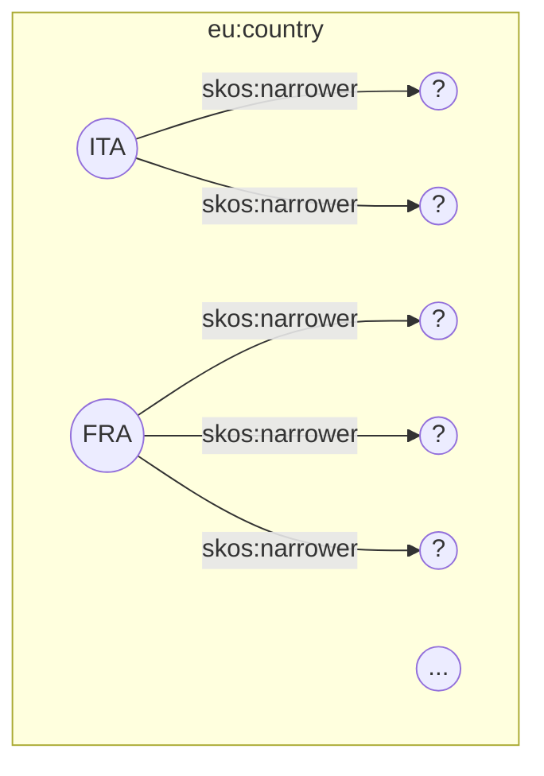
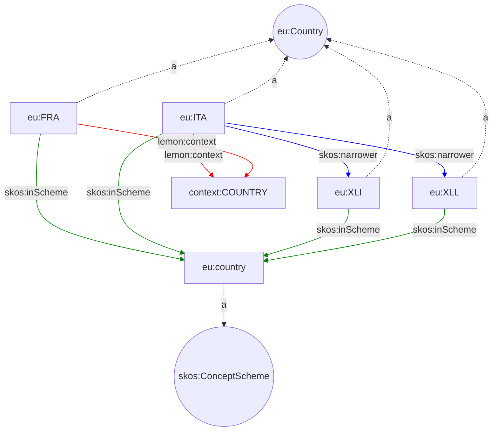

# Graph databases & SparQL

---

## Agenda

- Storing and retrieving triples
- The `rdflib.Dataset` class
- Querying and traversing graphs

*Beware*: commands may contain small typos. You must fix them to properly complete the course!

----

Prerequisites:

- JSON, YAML, xmlschema
- HTTP, OpenAPI 3
- SQL and database hints
- RDF & SparQL

```python
%pip install oxrdflib
```

---

## Graphs

### RDF databases

An RDF Dataset is a set of RDF graphs.

An RDF graph is an (unordered) set of triples.

Each triple consists of an *ordered* $subject$, $predicate$, $object$.

Graph databases such as:

- [Virtuoso (opensource)](https://virtuoso.openlinksw.com/),
- [GraphDB (proprietary)](),
- [Amazon Nepture (proprietary SaaS)]()

store triples into graphs and datasets.

They are *triple store*.

They can be queried via [SparQL]().

----

### Non-RDF databases: Neo4j

Another notable graph database is [Neo4j (opensource)]().

It is not a triple store, and it
adopt a different approach named [Labeled Property Graphs](https://en.wikipedia.org/wiki/Labeled_property_graph)

Neo4j can be queried with the [Cypher](https://neo4j.com/developer/cypher-query-language/) language.

Neo4j supports RDF datasets via the Neosemantics plugin.

----

### rdflib backends

We will simulate a graph database locally  using
[rdflib](https://rdflib.readthedocs.io/en/stable/index.html).

rdflib supports multiple backends to parse and store triples.

oxrdflib is a performant one
based on [Oxigraph](https://github.com/oxigraph/oxigraph).

Let's create a `Dataset`.

```python
from rdflib import Dataset

d = Dataset(store="Oxigraph")
```

Exercise:

- list the graphs into the dataset
  using SparQL (se the [05-sparql](05-sparql.ipynb)).


```solution
result = d.query("""
SELECT DISTINCT
  ?g
WHERE {
  GRAPH ?g {}
}
""")

assert 'default' in str(result.bindings)
```

- confront the query result with
  the output of `Dataset.graphs`

```solution
print(list(d.graphs()))
```

Let's load into it the [European vocabulary for countries](countries.ttl).

See also:

- [EU Authority Tables](https://op.europa.eu/en/web/eu-vocabularies/authority-tables)

- use `Dataset.bind` to bind the `eu` prefix to the
  `https://publications.europa.eu/resource/authority/` namespace;

```solution
d.bind("eu", "https://publications.europa.eu/resource/authority/")
```

Once the `eu` prefix is bound,
the dataset can expand cURIes.
Hint: see [01-knowledge](01-knowledge.ipynb).

```python
eu_country_id = d.namespace_manager.expand_curie("eu:country")
```

- use `Dataset.graph` to create the `eu:country` graph.

```solution
# Use the default backend
g = d.graph(eu_country_id)
```

Let's see the performance of the default
`turtle` parser ...

```python
# Parsing takes ~30s.
%time g.parse("countries-skos-ap-act.ttl", format="text/turtle")
print("The graph contains", len(g), "triples.")

# Clean up.
del g
del d
```

with respect to the `ox-turtle` parser.

```python
d = Dataset(store="Oxigraph")
country = d.graph(eu_country_id)
# Use the ox-turtle parser.
%time country.parse("countries-skos-ap-act.ttl", format="ox-turtle")
print("The graph contains", len(country), "triples.")
```

See also:

- <https://rdflib.readthedocs.io/en/stable/persistence.html>

---

### Traversing the graph

`<eu:country>` contains more than countries.



```python
# Shortcut for converting to curie.
to_curie = d.namespace_manager.curie
```

```python
q = """
PREFIX country: <http://publications.europa.eu/resource/authority/country/>

SELECT DISTINCT *
WHERE {
  country:ITA skos:narrower ?narrower .
  ?narrower skos:prefLabel ?label .
  FILTER (lang(?label) = "en")
}
"""
result = country.query(q)

narrower = {to_curie(r.narrower): str(r.label) for r in result}

print(*narrower.items(), sep="\n")
```

Exercise:

- run the above query replacing
  `skos:narrower` with `skos:narrower*`;
  what happens?

```solution
q = """
PREFIX country: <http://publications.europa.eu/resource/authority/country/>

SELECT DISTINCT *
WHERE {
  country:ITA skos:narrower* ?narrower .
  ?narrower skos:prefLabel ?label .
  FILTER (lang(?label) = "en")
}
"""
result = country.query(q)

narrower = {to_curie(r.narrower): str(r.label) for r in result}

print(*narrower.items(), sep="\n")
```

- run the above query using `country:FRA` and see what happens;
  then replace `skos:narrower` with `skos:narrower/skos:narrower`:
  do you see the same number of results?

```solution
q = """
PREFIX country: <http://publications.europa.eu/resource/authority/country/>

SELECT DISTINCT *
WHERE {
  country:FRA skos:narrower/skos:narrower ?narrower .
  ?narrower skos:prefLabel ?label .
  FILTER (lang(?label) = "en")
}
"""
result = country.query(q)

narrower = {to_curie(r.narrower): str(r.label) for r in result}

print(*narrower.items(), sep="\n")
```

<b>
The `*` operator traverses the graph
and find all the nodes reachable from the starting node through a given relation.
The `*` operator is not supported by all graph databases.
</b>

### Creating a graph

SparQL can create new graphs from an existing one.

```python
q = """
PREFIX country: <http://publications.europa.eu/resource/authority/country/>

CONSTRUCT {
  ?narrower
    skos:prefLabel ?label ;
    skos:broader ?broader .
}
WHERE {
  ?narrower
    # All resources transitively related to country:FRA...
    skos:broader* country:FRA ;

    # ... with their labels ...
    skos:prefLabel ?label ;

    # ... and their broader relations.
    skos:broader ?broader .

  FILTER (lang(?label) = "en")
}
"""
result = country.query(q)
list(result.graph)
```

Let's visualize the graph.

```python
import tools
from rdflib import SKOS

tools.plot_graph(result.graph, label_property=SKOS.prefLabel)
```

## More metadata

The Country graph contains more than countries ;)
the resource type is identified by the `<http://lemon-model.net/lemon#context>` predicate.

```python
q = """
PREFIX lemon: <http://lemon-model.net/lemon#>
PREFIX country: <http://publications.europa.eu/resource/authority/country/>
PREFIX context: <http://publications.europa.eu/resource/authority/use-context/>

SELECT DISTINCT
  ?broader
  (COUNT(?narrower) AS ?count_)
WHERE {
  ?broader
    skos:narrower+ ?narrower ;

    lemon:context context:COUNTRY ;

    # ... with their labels ...
    skos:prefLabel ?label .


  FILTER (lang(?label) = "en")
}
GROUP BY ?broader
ORDER BY ?count_
"""
result = country.query(q)
[
  {str(r.broader): str(r.count_)}
    for r
    in result
]
```

In RDF, you don't have hierarchies!


