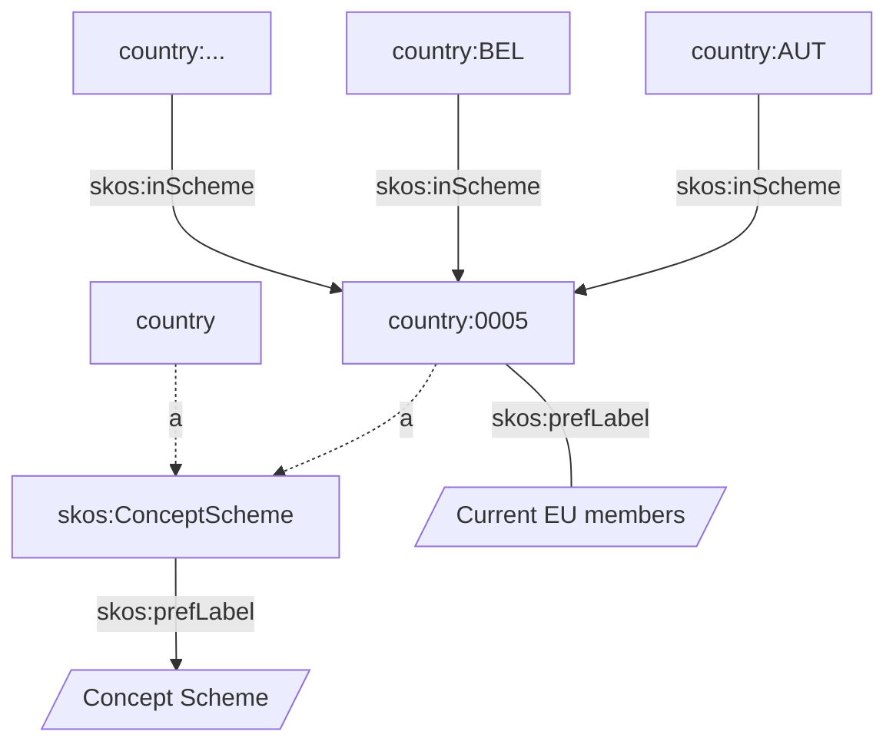
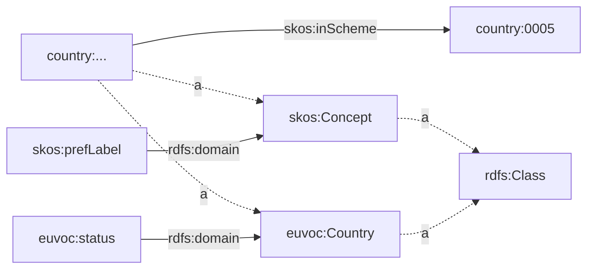

# Agenda

- Using SparQL to query metadata

## Metadata, Metadata

Between all triples,
some contain metadata,
such as:

- the resource types (`rdf:type`/`a`, or `rdfs:subClassOf` predicates);
- information about predicates;


```python
g=Graph(store="Oxigraph")

# Load the graph.
g.parse("countries-skos-ap-act.ttl", format="ox-turtle")
```

And query the simplest metadata.

```python
q = """
SELECT DISTINCT
  ?type
WHERE {
  ?s a ?type .
}
"""
result = g.query(q)

[r.type  for r in result]
```

We can simplify the above query
avoiding gathering `?s` at all
using the `[]` syntax
that matches anything.

```python
q = """
SELECT DISTINCT
  ?type
WHERE {
  [] a ?type .
}
"""
result = g.query(q)

[r.type  for r in result]
```

Exercise:

- where can you find the definition of `skos:Concept` and `skos:ConceptScheme`?

<!-- Open the URIRef in your browser -->

----

List `skos:ConceptScheme`s
and their labels.

```python
q = """
SELECT DISTINCT *
WHERE {
  ?ConceptScheme
    a skos:ConceptScheme  ;
    skos:prefLabel ?label .
    # Only English labels
    FILTER (lang(?label) = "en")
}
"""
result = g.query(q)
[r.asdict() for r in result]
```

Exercise:

- Rewrite the above query using
  two sentences.

<!-- SELECT DISTINCT * WHERE { ?ConceptScheme a skos:ConceptScheme . ?ConceptScheme skos:prefLabel ?label . } -->

----

Now find all the triples
where the `object` is
`<http://publications.europa.eu/resource/authority/country/0005>


```python
q = """
SELECT DISTINCT *
WHERE {
  ?s ?p <http://publications.europa.eu/resource/authority/country/0005> .
}
"""
result = g.query(q)
[r.asdict() for r in result]
```

Exercise:

- Rewrite the above query using
  the PREFIX directive.

<!-- PREFIX euvoc: <http://publications.europa.eu/resource/authority/country/> -->
<!-- SELECT DISTINCT * WHERE { ?s ?p euvoc:0005 } LIMIT 6-->

```python
q = """
PREFIX euvoc: <http://publications.europa.eu/resource/authority/country/>

SELECT DISTINCT *
WHERE {
  ?s ?p ...
}
LIMIT 6
"""
result = g.query(q)
[r.asdict() for r in result]
```

---

Let's visualize the graph
using:

- dotted lines to represent type relations
- parallelograms to represent literals



---

Now, query for the information
associated with the `country:AUT` node.

```python
q = """
PREFIX euvoc: <http://publications.europa.eu/resource/authority/country/>

SELECT DISTINCT *
WHERE {
  country:AUT ?p ?o .

  # Remove blank nodes.
  FILTER(!isBlank(?o))

}
"""

result = g.query(q)
print(*[(r.p.n3(), r.o.n3()) for r in result],sep="\n")
```

Exercise:

- query all skos:Schemes and their labels
  where `country:AUT`
- Hint: use two distinct sentences

<!-- SELECT DISTINCT * WHERE { country:AUT skos:inScheme ?o . ?o skos:prefLabel ?l . } -->

---

**A knowledge graph contains both data and the associated metadata.**
**There isn't a fixed schema, but a set of relations.**
**The actual schema is defined by the ontology and may evolve over time.**

---


Questions:

- List the namespaces registered in the graph.

<!-- list(g.namespaces()) -->

```python
q = """
SELECT DISTINCT *
WHERE {
  [] a ?type .
}
"""
result = g.query(q)
[r.type  for r in result]
```

```python
# For human readable results, bind prefixes.
g.bind("euvoc", "http://publications.europa.eu/ontology/euvoc#Country")
g.bind("country", "http://publications.europa.eu/resource/authority/country/")
to_curie = g.namespace_manager.curie

result = g.query("""
# You always need to bind the prefixes
PREFIX euvoc: <http://publications.europa.eu/ontology/euvoc#>

SELECT DISTINCT *
WHERE {
  ?c a euvoc:Country .
}
LIMIT 3
""")
[to_curie(r.c)  for r in result]
```

Now we will infer how countries are modeled
retrieving all associated predicates,
starting with the types.

We can list all the predicates
associated with `euvoc:Country`,
thus inferring how countries are modeled.

The fact that every property is defined by
an URI allows us to use
the same property in different contexts.

```python
q = """
PREFIX euvoc: <http://publications.europa.eu/ontology/euvoc#>
PREFIX country: <http://publications.europa.eu/resource/authority/country/>

SELECT DISTINCT *
WHERE {
  [] a euvoc:Country ;
     a ?type .
}
"""
result = g.query(q)
country_types = {r.type for r in result}
```

The data model extracted from the graph:
subjects in the country:0005 ConceptScheme
inherit properties from both `euvoc:Country`
and `skos:Concept`.


