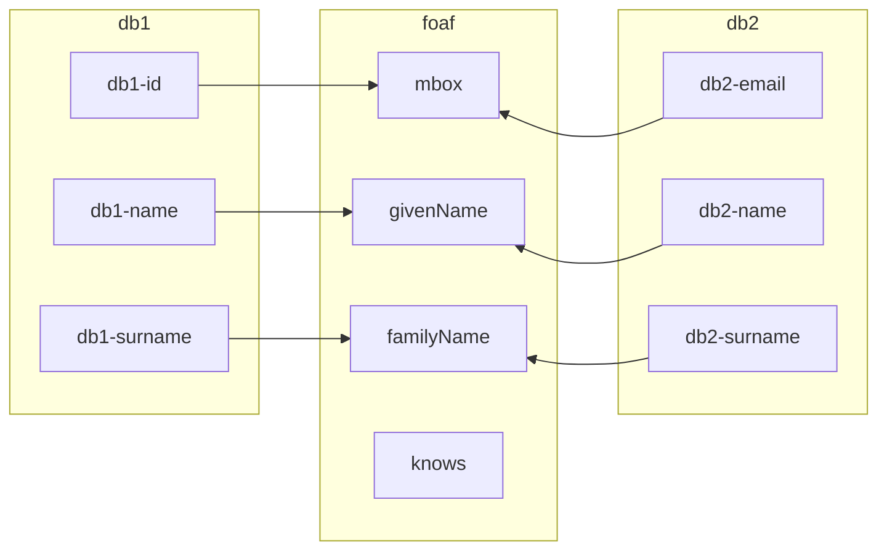

# Agenda

- Enriching data with external knowledge

- Starting from a dataset, identify keywords that can be
  used to link entries to external knowledge.

## Graphs vs Tables

When we store data in tables,
whe have a fixed schema.

Constraints have advantages:

- performance;
- data integrity;
- consistency.

----

Column meaning is defined outside the table, or
where possible, in the table header.

When a row is associated with a specific entity,
the table has an identifier column,
usually indexed.

| id | name  | surname | spouse         |
|----|-------|---------|----------------|
| 1  | Homer | Simpson |  ... |
| 2  | Marge | Simpson |  ... |
| 3  | Bart  | Simpson |  ... |

Another database related to the same entity
may have a different schema.

| email              | name  | surname | parent         |
|--------------------|-------|---------|----------------|
| <homer@simpsons.com> | Homer | Simpson ||
| <marge@simpsons.com> | Marge | Simpson ||
| <bart@simpsons.com> | Bart  | Simpson |

With RDF, there is no fixed syntactic schema.
Instead, we describe resources
using a public set of predicates
(`rdf:Property`es).



---

Let's contextualize some data
like we did in [07-jsonld](07-jsonld.ipynb).

Start with a json dataset.

```python
data = [
    {"email":"ft@a.test", "name": "Francisca", "surname": "Trujillo", "country": "ES"},
    {"email":"mr@a.test", "name": "Mario", "surname": "Rossi", "country": "IT"},
    {"email":"jd@a.test", "name": "Jane", "surname": "Doe", "country": "US"},
    {"email":"mg@a.test", "name": "Rashid", "surname": "Gowda", "country": "GB"},
]
```

Add a context to map the keys to IRIs.

```python
context = {
        "@vocab": "https://schema.org/",
        "my": "https://a.test/my#",
        # The code property is appended to the base URL to form the country URI.
        "email": "@id",
        "@base": "<mailto:>",
        "name": "givenName",
        "surname": "familyName",
        # Define a custom country property.
        "country": "my:country",
    }
```

Now assemble everything in a JSON-LD graph

```python
nodes_ld = {
    # Every country is a resource.
    "@graph": data,
    "@context": context,
}
```

Exercise:

- add a `"@type": "Person"` to every entry

```solution
nodes_ld = {
    # Every country is a resource.
    "@graph": [ { "@type": "Person", **c} for c in nodes],
    "@context": context,
}
```

Now create a dataset.

```python
from rdflib import Dataset

# Remember the default_union option.
d = Dataset(store='Oxigraph', default_union=True)
```

and bind the selected namespaces

```python
# Add ns shortcuts.
d.bind("eu", "https://publications.europa.eu/resource/authority/")
d.bind("schema": "https://schema.org/")
d.bind("euvoc": "http://publications.europa.eu/ontology/euvoc#")
d.bind("my":  "https://a.test/my#")
```

Exercise:

- list the graphs in the dataset; how many are there?

```solution
list(d.graphs())
```

Now load the JSON-LD data into a graph.

```python
import json
# Create a people graph and add the entries
people = d.graph(identifier="urn:People")
people.parse(data=json.dumps(nodes_ld), format="application/ld+json")
```

Exercise:

- list the triples in the dataset;

```solution
[t for t in d]
```

- list the triples in the `urn:People` graph;

```solution
[t for t in people]
```

Load the countries vocabulary in a new graph.

```python
country = d.graph(identifier="eu:country")
country.parse("countries-skos-ap-act.ttl", format="ox-turtle")
```

Now we have a graph to enrich with external data.

Match the custom country property with the ISO code
contained in the EU vocabulary
to retrieve the EU country identifier.

```python
q = """
SELECT DISTINCT
    ?person ?country
WHERE {

    # Match sentences in <urn:People>
    GRAPH <urn:People> {
        ?person
            a :Person ;
            my:country ?my_country_code .
    }

    # Match sentences in <eu:country>
    GRAPH <eu:country> {
        ?country a euvoc:Country ;
                skos:notation  ?isoCode ;
            .
    }

    # Match the isoCode of the country.
    FILTER ( ?isoCode = STRDT(?my_country_code,  euvoc:ISO_3166_1_ALPHA_2) )
}
"""

res = d.query(q)

[x.asdict() for x in res]

```

Exercise:

- Replace `<urn:People>` with `?g`: what happens?
- Can you replace both GRAPHs values with `?variables`?
- See the [string to datatype (STRDT) docs](https://www.w3.org/TR/sparql11-query/#func-strdt)

If that's OK, we can update the graph with the country identifier.

```python
q = """
INSERT {
  GRAPH <urn:People> {
    ?person :nationality ?country .
  }
}
WHERE {

    # Match sentences in <urn:People>
    GRAPH <urn:People> {
        ?person
            a :Person ;
            my:country ?my_country_code .
    }

    # Match sentences in <eu:country>
    GRAPH <eu:country> {
        ?country a euvoc:Country ;
                skos:notation  ?isoCode ;
            .
    }

    # Match the isoCode of the country.
    FILTER ( ?isoCode = STRDT(?my_country_code,  euvoc:ISO_3166_1_ALPHA_2) )
}
"""
d.update(q)
```

Now we can see the country identifier in the graph.

```python
print(d.graph(identifier="urn:People").serialize(format="turtle"))
```

Now, we can even have a "fat" graph with all the information

```python
q_country = """
PREFIX euvoc: <http://publications.europa.eu/ontology/euvoc#>

INSERT {
    GRAPH <urn:People> {
        ?p my:countryName ?countryName .
    }
}
WHERE {
    ?p a :Person ;
       :nationality ?country .

    ?country skos:prefLabel ?countryName .
    # We want the country name in English.
    FILTER ( LANG(?countryName) = "en" )
}
"""
d.update(q_country)

```

Exercise:

- in the first query, replace `?country` with `_:country`: does it work?

```solution
q = q_country.replace("?country", "_:country")
d.update(q)
```

We can also mangle the data a bit...

```python
q = """
INSERT {
    GRAPH <urn:People> {
        ?p my:phone ?plus_prefix .
    }
}
WHERE {
    ?p a :Person ;
       :nationality _:country .

    _:country skos:notation ?prefix  .

    # We want the country name in English.
    FILTER ( DATATYPE(?prefix) = euvoc:PHONE_PREFIX )

    # Bind a modified value to the variable ?plus_prefix.
    BIND (
        CONCAT("+", str(?prefix)) AS ?plus_prefix
    )
}
"""
d.update(q)
```

Exercise:

- write a SELECT query replacing the sentences

```turtle
?p a :Person ;
  :nationality _:country
.

_:country skos:notation ?prefix .
```

with the following **one**: does it work?

```turtle
?p a :Person ;
   :nationality [
       skos:notation ?prefix
   ]
.
```

```solution
SELECT DISTINCT
  *
WHERE {
    ?p a :Person ;
       :nationality [
        skos:notation ?prefix
       ]
    .
    # We want the country name in English.
    FILTER ( DATATYPE(?prefix) = euvoc:PHONE_PREFIX )

    # Bind a modified value to the variable ?plus_prefix.
    BIND (
        CONCAT("+", str(?prefix)) AS ?plus_prefix
    )
}
"""
d.query(q).bindings
```
