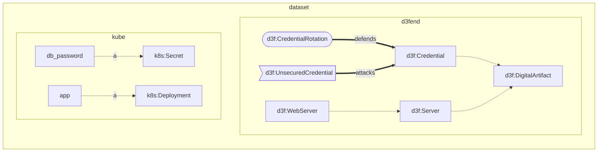
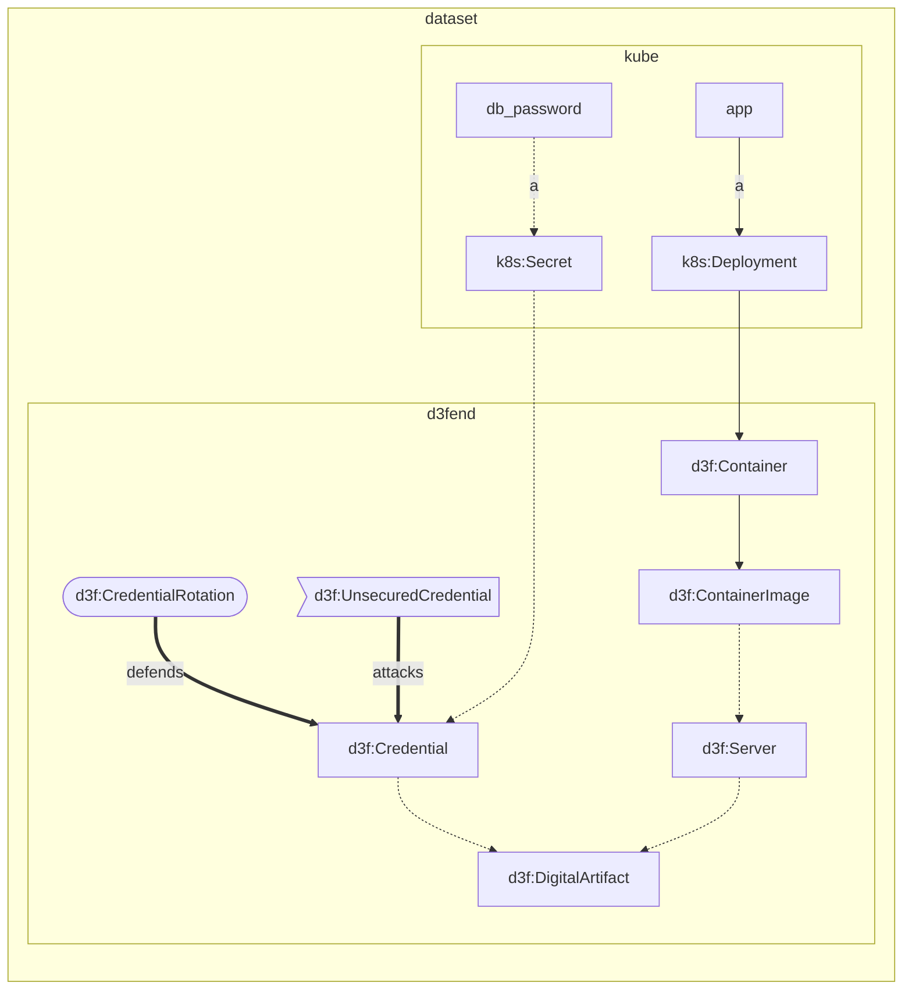

# Agenda

- Enriching data with external knowledge


## A real-life example: kubernetes infrastructure

Kubernetes is a resource orchestrator where you
describe resources in terms of
container images, ram, cpu, network.

```python
!cat guestbook-all-in-one.yaml
```

[d3fendtools](https://github.com/par-tec/d3fend-tools)
converts a Kubernetes YAML file to an RDF graph.

Let's load one.

```python
from rdflib import Dataset
d = Dataset(store='Oxigraph', default_union=True)
kube = d.graph("urn:my_app")
kube.parse("guestbook.ttl", format="turtle")
```

Exercise: display the graph using `tools.plot_graph`

```solution
import tools
tools.plot_graph(d.graph("urn:my_app"))
```

## D3FEND knowledge graph

D3FEND is a cybersecurity knowledge graph
containing a taxonomy of:

- digital artifacts (e.g., Server, Database, etc.);
- defensive techniques (e.g., Multifactor Authentication, Network Isolation, File Analysis, etc.);
- offensive techniques (e.g., Phishing, Content Injection, etc.).

Let's load the D3FEND graph.

```python
d.bind("d3f", "http://d3fend.mitre.org/ontologies/d3fend.owl#")
d3fend = d.graph("http://d3fend.mitre.org/ontologies/d3fend.owl")
d3fend.parse("d3fend.ttl", format="ox-turtle")
```

Exercise:

- list digital artifacts

```solution
q = """
SELECT DISTINCT ?artifact
WHERE {
  ?artifact rdfs:subClassOf d3f:DigitalArtifact .
}
LIMIT 10
"""
result = d.query(q)
list(result)
```

- use the `rdfs:subClassOf` predicate to list the
subclasses of `d3f:Server`

```solution
q = """
SELECT DISTINCT ?artifact
WHERE {
  ?artifact rdfs:subClassOf d3f:Server .
}
"""
result = d.query(q)
list(result)
```

Now we use `CONSTRUCT` to create a graph of the subclasses of `d3f:Server`

```solution
q = """
CONSTRUCT {
  ?artifact rdfs:subClassOf ?parent .
}
WHERE {
  ?artifact rdfs:subClassOf ?parent .
  ?parent rdfs:subClassOf* d3f:Server .
}
"""
servers = d.query(q).graph
```

Exercise: display the graph of subclasses of `d3f:Server`

```solution
import tools
tools.plot_graph(servers)
```

- list defensive techniques that are subclasses with `d3f:FileAnalysis`
  together with their `d3f:definition`s

```solution
q = """
SELECT DISTINCT
    ?technique
    ?definition
WHERE {
  ?technique rdfs:subClassOf* d3f:FileAnalysis ;
    d3f:definition ?definition .
}
"""

for r in d.query(q):
    print(r.technique, r.definition)
```

Now, let's list the defensive techniques associated with the `d3f:Server` artifact.

```python
q = """
SELECT DISTINCT
    ?technique
    ?artifact
WHERE {
  ?technique rdfs:subClassOf* d3f:DefensiveTechnique .
  ?artifact rdfs:subClassOf* d3f:Server .

  ?technique ?protects ?artifact .
}
"""
result = d.query(q)
for r in result:
    print(f"{r.technique} protects {r.artifact}")
```

Exercise:

- show the `rdfs:label` of the `?technique`

```solution
q = """
SELECT DISTINCT
    ?technique_label
    ?artifact
WHERE {
  ?artifact rdfs:subClassOf* d3f:Server .

  ?technique rdfs:subClassOf* d3f:DefensiveTechnique .
  ?technique ?protects ?artifact .
  ?technique rdfs:label ?technique_label .
}
"""
result = d.query(q)
for r in result:
    print(f"{r.technique_label} protects {r.artifact}")
```

- replace `d3f:DefensiveTechnique` with `d3f:OffensiveTechnique`
  and list offensive techniques that affect the `d3f:Server` artifact

```solution
q = """
SELECT DISTINCT
    ?technique_label
    ?artifact
WHERE {
  ?artifact rdfs:subClassOf* d3f:Server .

  ?technique rdfs:subClassOf* d3f:OffensiveTechnique ;
    rdfs:label ?technique_label ;
    ?protects ?artifact
  .
}
"""
result = d.query(q)
for r in result:
    print(f"{r.technique_label} attacks {r.artifact}")
```

## Packing it all together

Let's look at our dataset now:

- one contains our application infrastructure;
- one contains cybersecurity knowledge, including
  artifacts, offensive and defensive techniques.



The kube graph contains not only the Kubernetes resources...

```python
q = """
SELECT DISTINCT
  ?kube
WHERE {
  # Kubernetes resources.
  ?kube rdfs:subClassOf* k8s:Kind .
}
"""
[str(x[0]) for x in kube.query(q)]
```

.. but even links to the D3FEND graph.

```python
q = """
PREFIX k8s: <urn:k8s:>
PREFIX d3f: <http://d3fend.mitre.org/ontologies/d3fend.owl#>
PREFIX rdfs: <http://www.w3.org/2000/01/rdf-schema#>

SELECT DISTINCT
  ?kube
  ?d3fend
WHERE {
  # Kubernetes resources.
  GRAPH <urn:my_app> {
    ?kube rdfs:subClassOf* k8s:Kind ;
        rdfs:subClassOf ?d3fend
    .
  }

  # D3FEND resources.
  GRAPH <http://d3fend.mitre.org/ontologies/d3fend.owl>{
    ?d3fend rdfs:subClassOf* d3f:DigitalArtifact .
  }
}
"""
for r in d.query(q):
    print(
      r.kube,
      "is a",
      # shorten using prefix
      d.namespace_manager.curie(r.d3fend)
    )
```

So we actually get links between our application
objects and the d3fend knowledge base.



So we can ask for example
the attack classes towards
our components.

```python
attack_surface = d.query("""
SELECT DISTINCT
  ?attack_label
  ?affects
  ?artifact
  ?kube_resource
WHERE {

  ?kube_resource a ?kind .

  # Get digital artifacts associated with Kubernetes resources.
  ?kind rdfs:subClassOf* k8s:Kind,  .
  ?kind rdfs:subClassOf* d3f:DigitalArtifact .
  ?kind rdfs:subClassOf ?artifact .


  ?attack
    d3f:attack-id ?attack_id;
    rdfs:label ?attack_label .

  ?attack ?affects ?artifact .

}
""")

for attack in sorted(attack_surface):
    print(f"{attack.attack_label}, "
          f"{attack.affects.fragment} {attack.artifact.fragment} for {attack.kube_resource}")

```

Exercise:

- simplify the query materializing the digital artifacts
  associated with Kubernetes resources
  directly at the level of the `?kube_resource`, e.g.

```turtle
# Original graph
...
k8s:Secret rdfs:subClassOf d3f:Credential ;
  rdfs:subClassOf k8s:Kind .

<:secret> a k8s:Secret .

# Add this triple too
<:secret> a d3f:Credential .
```


## Summary

That was the last lesson:
you can mix and mingle all the information
